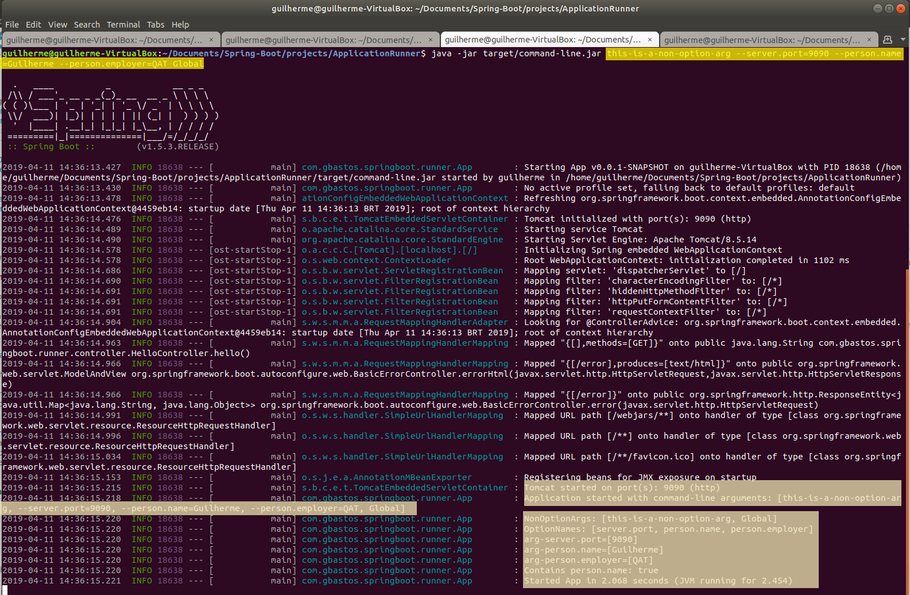

# Spring Boot Studies [](https://github.com/sindresorhus/awesome)
> This repository keeps evolving as I continue covering more functionalities and techniques from Spring boot application.

A generic repository for study purposes, with all the exercises from the https://www.tutorialspoint.com/spring_boot

[Get back to the main Summary Page.](https://github.com/guilhermeborgesbastos/Spring-Boot-Studies)


# Spring Boot - Application & Command Line Runners

## What is a Application Runner for Spring Boot?
*Application Runner* and *Command Line Runner* **interfaces** lets you to execute the code after the Spring Boot application is started. You can use these interfaces to perform any actions immediately after the application has started. This chapter talks about them in detail.


## Application Runner

*Application Runner* is an interface used to execute the code after the Spring Boot application started. The example given below shows how to implement the Application Runner interface on the main class file.
```
package com.gbastos.springboot.runner;

import org.slf4j.Logger;
import org.slf4j.LoggerFactory;
import org.springframework.boot.ApplicationArguments;
import org.springframework.boot.ApplicationRunner;
import org.springframework.boot.SpringApplication;
import org.springframework.boot.autoconfigure.SpringBootApplication;

import java.util.Arrays;

@SpringBootApplication
public class App implements ApplicationRunner {

    private static final Logger logger = LoggerFactory.getLogger(App.class);

    public static void main(String... args) throws Exception {
        SpringApplication.run(App.class, args);
    }

    @Override
    public void run(ApplicationArguments args) throws Exception {
        logger.info("Application started with command-line arguments: {}", Arrays.toString(args.getSourceArgs()));
        logger.info("NonOptionArgs: {}", args.getNonOptionArgs());
        logger.info("OptionNames: {}", args.getOptionNames());

        for (String name : args.getOptionNames()){
            logger.info("arg-" + name + "=" + args.getOptionValues(name));
        }

        Boolean containsOption = args.containsOption("person.name");
        logger.info("Contains person.name: " + containsOption);
    }
}
```

The overriding *run()* method writes in the log info regarding:

* **The command-line arguments sent in the application start**
Spring Boot application converts the command line properties into Spring Boot Environment properties. Command line properties take precedence over the other property sources. The parameter can be sent to Spring Boot via command line:
```
java -jar target/command-line.jar this-is-a-non-option-arg --server.port=9090 --person.name=Guilherme --person.employer='QAT Global'
```
**Note** − You can provide more than one application properties by using the delimiter −.

* **Properties File**

In case of the existence of the `application.properties` file located in the `src/main/resources` folder, the default properties will be overridden by the ones sent in the command line. For example:
```
person.name=Default Name Parameter
person.employer=Default Employer Parameter
```

There is also non optional argument, in the example above is the `this-is-a-non-option-arg`, look at the Spring Boot terminal logging of this example:



Right after the application start the `run()` method is executed, in this example, reading parameters from the command line.

## Injecting Arguments in the Controller layer

It's also possible to inject via Dependency Injection the values for each property in the controller layer. The **@Value** Annotation allow us to do that, look at the example below:
```
package com.gbastos.springboot.runner.controller;

import org.springframework.beans.factory.annotation.Value;
import org.springframework.web.bind.annotation.GetMapping;
import org.springframework.web.bind.annotation.RestController;

@RestController
public class HelloController {

    @Value("${person.name}")
    private String name;
    

    @Value("${person.employer}")
    private String employer;

    @GetMapping
    public String hello(){
        return "Hello, " + name + " from " + employer + "!";
    }
}
```

By executing the application seeting the following properties using the command line below:

```
java -jar target/command-line.jar --server.port=9090 --person.name='Bill Gates' --person.employer='Microsoft Corporation'
```

When accessing the `HelloController` via browser we will see:


**Note** − If the property is not found while running the application, Spring Boot throws the **Illegal Argument exception** as Could not resolve placeholder 'spring.application.name' in value `${person.name}`.

To resolve the placeholder issue, we can set the default value for the property using thr syntax given below −
```
@Value("${property_key_name:default_value}")

@Value("${person.name:Guilherme}")
```

## Spring Boot Active Profile

Spring Boot supports different properties based on the **Spring active profile**. For example, we can keep two separate files for *development* and *production* to run the Spring Boot application.
Spring active profile in application.properties

Let us understand how to have Spring active profile in application.properties. By default, application. properties will be used to run the Spring Boot application. If you want to use profile based properties, we can keep separate properties file for each profile as shown below −

**application.properties**
```
server.port = 8080
spring.application.name = demoservice
```
**application-dev.properties**
```
server.port = 9090
spring.application.name = demoservice
```
**application-prod.properties**
```
server.port = 4431
spring.application.name = demoservice
```
While running the JAR file, we need to specify the spring active profile based on each properties file. By default, Spring Boot application uses the application.properties file. The command to set the spring active profile is shown below −
```
java -jar target/command-line.jar --spring.profiles.active=dev
```

**Prod.Properties Active Dev**

You can see active profile name on the console log as shown below −

```
2017-11-26 08:13:16.322  INFO 14028 --- [           
   main] com.tutorialspoint.demo.DemoApplication  :
   The following profiles are active: dev
```

Now, Tomcat has started on the port 9090 (http) as shown below −
```
2017-11-26 08:13:20.185  INFO 14028 --- [           
   main] s.b.c.e.t.TomcatEmbeddedServletContainer : 
   Tomcat started on port(s): 9090 (http)
```

**Prod.Properties Active Prod**

You can set the Production active profile as shown below −
```
java -jar target/command-line.jar --spring.profiles.active=prod
```
You can see active profile name on the console log as shown below −
```
2017-11-26 08:13:16.322  INFO 14028 --- [           
   main] com.tutorialspoint.demo.DemoApplication  :
   The following profiles are active: prod
```
Now, Tomcat started on the port 4431 (http) as shown below −
```
2017-11-26 08:13:20.185  INFO 14028 --- [          
   main] s.b.c.e.t.TomcatEmbeddedServletContainer :
   Tomcat started on port(s): 4431 (http)
```

**Note** - All the configurations done on this chapter can be done via application.yml file.

