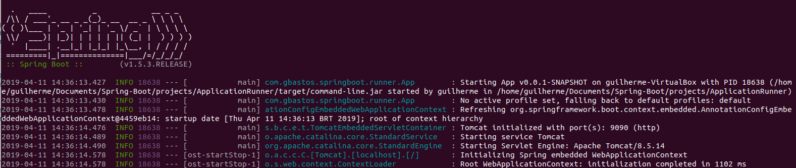

# Spring Boot Studies [](https://github.com/sindresorhus/awesome)
> This repository keeps evolving as I continue covering more functionalities and techniques from Spring boot application.

A generic repository for study purposes, with all the exercises from the https://www.tutorialspoint.com/spring_boot

[Get back to the main Summary Page.](https://github.com/guilhermeborgesbastos/Spring-Boot-Studies)


# Spring Boot - Logging

Spring Boot uses Apache Commons logging for all internal logging. Spring Boot’s default configurations provides a support for the use of Java Util Logging, [Log4j2](https://logging.apache.org/log4j/2.x/), and [Logback](https://logback.qos.ch/). Using these, we can configure the console logging as well as **file** logging.

If you are using Spring Boot Starters, Logback will provide a good support for logging. Besides, Logback also provides a use of good support for Common Logging, Util Logging, Log4J, and SLF4J.

## Log Format

The default Spring Boot Log format is shown in the screenshot given below.




Which gives you the following information

* **Date** and **Time** that gives the date and time of the log;
* Log **level** shows *INFO, ERROR or WARN*;
* Process **ID**;
* The --- which is a separator
* **Thread name** is enclosed within the square brackets []
* **Logger Name** that shows the Source class name
* The Log message

## Console Log Output

The default log messages will print to the console window. By default, *INFO*, *ERROR* and *WARN* log messages will print in the log file.

If you have to enable the debug level log, add the debug flag on starting your application using the command shown below −
```
java –jar demo.jar --debug
```
You can also add the debug mode to your `application.properties` file as shown here −
```
debug = true
```

## File Log Output

By default, all logs will print on the console window and not in the files. If you want to print the logs in a file, you need to set the property **logging.file** or **logging.path** in the `application.properties` file.

You can specify the log file path using the property shown below. Note that the log file name is spring.log.
```
logging.path = /var/tmp/
```

You can specify the own log file name using the property shown below −
```
logging.file = /var/tmp/mylog.log
```

**Note** − files will rotate automatically after reaching the size 10 MB.

## Log Levels

Spring Boot supports all logger levels such as `TRACE, DEBUG, INFO, WARN, ERROR, FATAL, OFF`. You can define Root logger in the `application.properties` file as shown below −
```
logging.level.root = WARN
```

**Note** − Logback does not support `FATAL` level log. It is mapped to the `ERROR` level log.

# Logback Framework

*Logback* is one of the most widely used **logging frameworks** in the Java Community. It’s a replacement for its predecessor, *Log4j*. *Logback* offers a **faster** implementation than *Log4j*, provides more options for **configuration**, and more **flexibility** in archiving old log files.

## Logback Architecture

Three classes comprise the *Logback* architecture; **Logger**, **Appender**, and **Layout**.

A **logger** is a context for log messages. This is the class that applications interact with to create log messages.

**Appenders** place log messages in their final destinations. A Logger can have more than one Appender. We generally think of Appenders as being attached to text files, but Logback is much more potent than that.

Layout prepares messages for outputting. *Logback* supports the creation of custom classes for formatting messages, as well as robust configuration options for the existing ones.

## Logback Setup

### Maven Dependency

*Logback* uses the Simple Logging Facade for Java (SLF4J) as its native interface. Before we can start logging messages, we need to add *Logback* and *Slf4j* to our `pom.xml`:

```
<dependency>
    <groupId>ch.qos.logback</groupId>
    <artifactId>logback-core</artifactId>
    <version>1.2.3</version>
</dependency>
 
<dependency>
    <groupId>org.slf4j</groupId>
    <artifactId>slf4j-api</artifactId>
    <version>1.8.0-beta2</version>
    <scope>test</scope>
</dependency>
```

**Note** - Maven Central has the latest version of the *Logback* Core and the most recent version of *slf4j-api*.

### Classpath

*Logback*  also requires [logback-classic.jar](https://search.maven.org/classic/#search%7Cga%7C1%7Clogback-classic)  on the classpath for runtime.

We’ll add this to `pom.xml` as a **test** dependency:

```
<dependency>
    <groupId>ch.qos.logback</groupId>
    <artifactId>logback-classic</artifactId>
    <version>1.2.3</version>
</dependency>
```
### Basic Example and Configuration

Let’s start with a quick example of using *Logback* in an application.

First, we need a configuration file. We’ll create a text file named `logback.xml` and put it somewhere in our classpath:

```
<configuration>
  <appender name="STDOUT" class="ch.qos.logback.core.ConsoleAppender">
    <encoder>
      <pattern>[GBASTOS] %d{HH:mm:ss.SSS} [%thread] %-5level %logger{36} - %msg%n</pattern>
    </encoder>
  </appender>
 
  <root level="debug">
    <appender-ref ref="STDOUT" />
  </root>
</configuration>
```

Next, we need a simple class with a main method:

```
public class LoggingApplication {
 
    private static final Logger LOG 
      = LoggerFactory.getLogger(LoggingApplication.class);
 
    public static void main(String[] args) {
        LOG.info("Example log from {}", LoggingApplication.class.getSimpleName());
    }
}
```

This class creates a Logger and calls `info()` to generate a log message.

When we run *LoggingApplication* we see our message logged to the console:
```	
[GBASTOS] 10:33:12.149 [main] INFO com.gbastos.logging.LoggingApplication - Example log from LoggingApplication
```

It’s easy to see why Logback is so popular; we’re up in running in minutes.

This configuration and code give us a few hints as to how this works.

Now that we understand the basics, let’s have a closer look.

### Using a Context

Let’s create an example program that demonstrates using a context within logging hierarchies:

```	
ch.qos.logback.classic.Logger parentLogger = 
  (ch.qos.logback.classic.Logger) LoggerFactory.getLogger("com.gbastos.logging.logback");
 
parentLogger.setLevel(Level.INFO);
 
Logger childLogger = 
  (ch.qos.logback.classic.Logger)LoggerFactory.getLogger("com.gbastos.logging.logback.tests");
 
parentLogger.warn("This message is logged because WARN > INFO.");
parentLogger.debug("This message is not logged because DEBUG < INFO.");
childLogger.info("INFO == INFO");
childLogger.debug("DEBUG < INFO");
```

When we run this, we see these messages:
```	
[GBASTOS] 17:02:46.580 [main] WARN  com.gbastos.logging.logback - This message is logged because WARN > INFO.
[GBASTOS] 17:02:46.580 [main] INFO  com.gbastos.logging.logback.tests - INFO == INFO
```

We start by retrieving a Logger named `com.gbastos.logging.logback` and cast it to a `ch.qos.logback.classic.Logger`.

A **Logback context** is needed to set the level in the next statement; note that the SLF4J’s abstract logger does not implement `setLevel()`.

We set the level of our context to **INFO**; we then create another logger named `com.gbastos.logging.logback.tests`.

We log two messages with each context to demonstrate the hierarchy. *Logback* logs the **WARN**, and **INFO** messages and filters the **DEBUG** messages.

Now, let’s use the root logger:
```	
ch.qos.logback.classic.Logger logger = 
	(ch.qos.logback.classic.Logger)LoggerFactory.getLogger("com.gbastos.logging.logback");
logger.debug("Hi there!");

ch.qos.logback.classic.Logger rootLogger = 
	(ch.qos.logback.classic.Logger)LoggerFactory.getLogger(org.slf4j.Logger.ROOT_LOGGER_NAME);
logger.debug("This message is logged because DEBUG == DEBUG.");

rootLogger.setLevel(Level.ERROR);

logger.warn("This message is not logged because WARN < ERROR.");
logger.error("This is logged.");
```

We see these messages when we execute this snippet:
```	
[GBASTOS] 18:23:49.424 [main] INFO  com.gbastos.logging.LoggingApplication - Example log from LoggingApplication, using the root logger context
[GBASTOS] 18:23:49.424 [main] WARN  com.gbastos.logging.logback - This message is not logged because WARN < ERROR.
[GBASTOS] 18:23:49.424 [main] ERROR com.gbastos.logging.logback - This is logged.
```
To conclude, we started with a Logger context and printed a *DEBUG* message.

We then retrieved the root logger using its statically defined name and set its level to *ERROR*.

And finally, we demonstrated that *Logback* actually does filter any statement less than an error.

[Read more](https://www.baeldung.com/logback)

