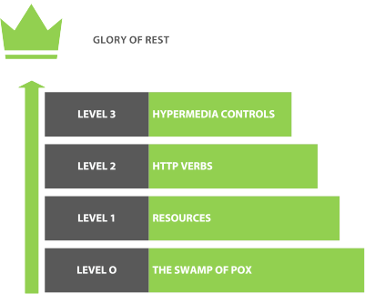
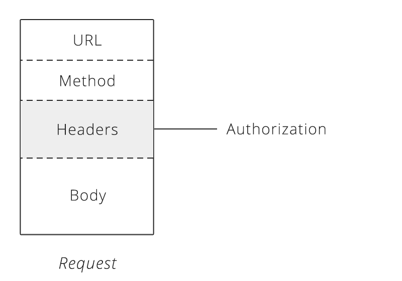
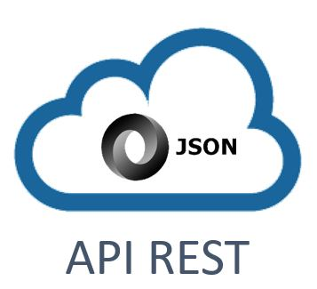

# Spring Boot Studies [](https://github.com/sindresorhus/awesome)
> This repository keeps evolving as I continue covering more functionalities and techniques from Spring boot application.

A generic repository for study purposes, with all the exercises from the https://www.tutorialspoint.com/spring_boot

[Get back to the main Summary Page.](https://github.com/guilhermeborgesbastos/Spring-Boot-Studies)


# Spring Boot - Rest Concepts and Rest Template

## What is REST Architecture?

It's a sustainable architecture that allows communication between multiple applications. It means **Representational State Transfer** and it has to do with the `Client` and `Server` relationship and how `state` is stored. In the early days of *Web Development*, it became needed that the *Server Side* of the *Web Application* remember certain details about the `User` that was using it.

For example, if you are going to write an application in the classic ASP *(Not usual nowadays)* and somebody logs in and you want to store its name and a couple of other properties about them, you could store these properties in a Session variable in the Server. The side effect of this approach is that the Server would then reserve a little bit o memory for that User and that is what is called `Session`.

And so, the more users you get, the more memory would be taken up from the Server and if your application needs to serve thousands of people at the same time, the memory would quickly be full and you would face performance and scale issues on your application. So, what was the solution then?

### Database Session

An advanced in that was to store the `State` in a Database, using a Token passed between Client and Server. Further advancement of this was the concept of **REST**.

### REST Concept

Its concept is basically that the Client passes to the server everything that the server needs to perform the action, returning to the Client the status of the action. The Server doesn't need to remember anything about the client.

#### REST & HTTP

RESTful services often use HTTP protocol verbs, not a coincidence because the person who came with the idea of RESTful service it's also the same person that defined HTTP specifications:
- `GET`, `POST`, `PUT`, `PATCH`, `OPTIONS`,  `HEAD` and `DELETE`;

#### REST URLs

In the `RESTful` there is a URL pattern, see the example below:

* **Before**
	* `http://example.com`/`UpdateEmployee.aspx`
	* The URL represents a directory structure and an specific file;
	
* **REST**
	* `http://example.com`/`Employee`/ `Edit`/`1234`
	* The URL represents a mapping based on actions and groups;
	
The `RESTful` spec requires specific **Media Types** as response, such as:

* `XML` and `JSON` notations;

**Note**  - `RESTful` services do not return HTML to the Client.

## Difference between REST and RESTful

First of all, `REST` is not a specific web service but a design concept *(architecture)* for managing state information.  Some literatures say that the term `RESTful API` It has to do with the maturity of your Web Application based on the **Richardson REST Maturity Model** that describes four different levels of REST *(starting at Level 0)*. A REST API that supports `hypermedia controls` is classified as **Level 3** in this maturity model: 

The levels of maturity according to [Richardson’s model](http://martinfowler.com/articles/richardsonMaturityModel.html):




When discussing the *REST API* maturity level design we have to think about the following: *Versioning, Actions, Errors, Pagination and more*. Below are the basic maturity levels, adding a REST API design perspective. For more information on some of the rules please read these as well:

[REST Main Rules](#rest-main-rules)

### Level 0 - The Swamp of POX

The **Swamp of POX** *(Plain Old XML)* means that you’re using **HTTP**. Technically, *REST* services can be provided over any application layer protocol as long as they conform to certain properties. In practice, basically, everyone uses HTTP.

These services have a single URI and use a single HTTP method *(typically POST)*. These are the most primitive way of building SOA *(Service-oriented architecture)* applications with a single POST method and using XML to communicate between services.

Level zero of maturity does not make use of any of *URI*, *HTTP Methods*, and *HATEOAS* capabilities.


### Level 1 - Resources

REST’s ‘resources’ are the core pieces of data that your application acts on. These will often correspond to the Models in your application *(especially if you’re following the MVC - model, view, controller pattern)*.

API design at Level 1 is all about using different URLs to interact with the different resources in your application.

Let’s write few APIs for Blog which has some articles, to understand more. `/getAllArticles` is an API which will respond with the list of articles.

Few more APIs around a Blog will look like as follows:
`/addNewArticle`
`/updateArticle`
`/deleteArticle`
`/deleteAllArticle`
`/promoteArticle`
`/promoteAllArticle`

There are a set of common operations that are performed on resources, and it seems kinda silly to make a new URI for every operation, especially when they’re shared - That is where Level 2 comes in. 

### Level 2 - Methods

We are always going to need to perform CRUD operations on our resources, so why not find a way to share these operations across resources? Why create a new resource for each action or operation we would like to perform?

We accomplish this using `HTTP Verbs`. If we want to get a list of Pages, we make a `GET` request to `/pages`, but if we want to create a new Page, we use `POST` rather than `GET` to the same resource - `/pages`.

Here is the common Methods / Actions used:

| Method   |      Scope      |  Semantics |
|----------|:-------------:|------:|
| GET |  collection | Retrieve all resources in a collection |
| GET |    resource   |   Retrieve a single resource |
| HEAD | collection |  Retrieve all resources in a collection *(header only)* |
| HEAD |    resource   |   Retrieve a single resource *(header only)* |
| POST |    collection   |   Create a new resource in a collection |
| PUT |    resource   |   Update a resource |
| PATCH |    resource   |   Update a resource |
| DELETE |    resource   |   Delete a resource |
| OPTIONS |   any   |   Return available HTTP methods and other options |

#### Level 2.1 - *HTTP headers*

The HTTP headers are one of the [basic design rules for REST APIs](https://blog.restcase.com/5-basic-rest-api-design-guidelines/). They are needed in order to convey more data about the resource itself, mostly meta-data, security, hashes and more.



HTTP headers also provide the required information about the request or response, or as we said - about the object sent in the message body.

**There are 4 types of HTTP message headers:**

* **General Header** - These header fields have general applicability for both request and response messages.

* **Client Request Header** - These header fields have applicability only for request messages.

* **Server Response Header** - These header fields have applicability only for response messages.

* **Entity Header** - These header fields define meta information about the entity-body or, if no BODY is present, about the resource identified by the request.

#### Level 2.2 - *Query Parameters*

Another important part of [REST API design](https://www.restcase.com/) is using query parameters.
They are widely used in many cases but it is more likely that they are used in order to achieve some sort of `searching`, `filtering`, and `querying`.

* **Paging** - It is necessary to anticipate the paging of your resources in the early design phase of your API. It is indeed difficult to foresee precisely the progression of the amount of data that will be returned. Therefore, we recommend paginating your resources with default values when they are not provided by the calling client, for example with a range of values [0-25].

* **Filtering** - Filtering consists in restricting the number of queried resources by specifying some attributes and their expected values. It is possible to filter a collection on several attributes at the same time and to allow several values for one filtered attribute.

* **Sorting** - Sorting the result of a query on a collection of resources. A sort parameter should contain the names of the attributes on which the sorting is performed, separated by a comma.

* **Searching** - A search is a sub-resource of a collection. As such, its results will have a different format than the resources and the collection itself. This allows us to add suggestions, corrections, and information related to the search. 

#### Level 2.3 -* Status Codes*

It is very important that as a RESTful API, you make use of the proper HTTP Status Codes, especially when developing and mocking RESTful API.

**The mostly used status codes:**

* **200 – OK**
	Everything is working

* **201 – CREATED**
	A new resource has been created

* **204 – NO CONTENT**
	The resource was successfully deleted, no response body

* **304 – NOT MODIFIED**
	The date returned is cached data (data has not changed)

* **400 – BAD REQUEST**
	The request was invalid or cannot be served. The exact error should be explained in the error payload. E.g. „The JSON is not valid “.

* **401 – UNAUTHORIZED**
	The request requires user authentication.

* **403 – FORBIDDEN**
	The server understood the request but is refusing it or the access is not allowed.

* **404 – NOT FOUND**
	There is no resource behind the URI.

* **500 – INTERNAL SERVER ERROR**
	API developers should avoid this error. If an error occurs in the global catch blog, the stack trace should be logged and not returned as a response.

### Level 3 - Hypermedia Controls

This level is the one that everyone falls down on. There are two parts to this: `content negotiation` and `HATEOAS`. Content negotiation is focused on different representations of a particular resource, and HATEOAS is about the discoverability of actions on a resource.

#### Content Negotiation

Generally, resources can have multiple presentations, mostly because there may be multiple different clients expecting different representations. Asking for a suitable presentation by a client is referred to as content negotiation.

> HTTP has provisions for several mechanisms for “content negotiation” — the process of selecting the best representation for a given response when there are multiple representations available.



#### **Content Negotiation is performed by an application:**

To match the requested representation as specified by the client via the `Accept` header with a representation the application can deliver.
To determine the `Content-Type` of incoming data and deserialize it so the application can utilize it.

Essentially, `content negotiation` **is the client telling the server what it is sending and what it wants in return, and the server determining if it can do what the client requests.**

`Accept` - The **Accept** request HTTP header advertises which content types, expressed as MIME types, the client is able to understand. Using **content negotiation**, the server then selects one of the proposals, uses it and informs the client of its choice with the `Content-Type` response header. Browsers set adequate values for this header depending on the context where the request is done: when fetching a CSS stylesheet a different value is set for the request than when fetching an image, video or a script.

#### `Accept` **Negotiation**

The first aspect of content negotiation is handling the `Accept` header. The Accept header has one of the most complex definitions in the HTTP specification. With supplying this header in the request, a client can indicate a prioritized list of different media types that it will accept as responses from the server.

In practice, particularly with APIs, you will send a specific media type for the representation you can handle in your client. As an example:

```
GET /foo HTTP/1.1
Accept: application/json
```

The above indicates that the client wants JSON for a response. It is now the server's responsibility to determine if it can return that representation.

If the server can not return JSON, it needs to tell the client that fact. This is done via the `406 - Not Acceptable` status code:

`HTTP/1.1 406 Not Acceptable` - Ideally, the server will also indicate what media types it can return; however, it is not obligated to do so.

Because the server cannot return a representation for the requested media type, it can choose whatever media type it wants for the response in order to communicate errors.

If the server can return the requested media type, it should report the media type via the response [Content-Type](https://developer.mozilla.org/en-US/docs/Web/HTTP/Headers/Content-Type) header.

One important point of interest: the same URI can potentially respond with multiple media types. This means that you could potentially make one request that specifies `text/html`, another with `application/json`, and get different representations of the same resource!

**NOTE** - *This is a very important aspect of content negotiation; one of the purposes is to allow many clients to the same resource, speaking in different protocols.*

#### `Content-Type` **Negotiation**

The second aspect of content negotiation is identifying the incoming `Content-Type` header and determining if the server can deserialize that data.

As an example, the client might send the following:

```
POST /foo HTTP/1.1
Accept: application/json
Content-Type: application/json
{
    "foo": "bar"
}
```

The server would introspect the `Content-Type` header and determine that JSON was submitted. Now it has to decide if it can deserialize that content. If it cannot, the server will respond with a `415 Unsupported Media Type` status code:

`HTTP/1.1 415 Unsupported Media Type`

If the data submitted is not actually of the Content-Type specified, meaning it cannot be deserialized properly, the server will typically respond with a generic `400 Bad Request` status.

#### HATEOAS

Hypermedia As Transfer Engine Of Application State is a constraint of the REST application architecture that distinguishes it from other network application architectures.

It provides ease of navigation through a resource and its available actions. This way a client doesn’t need to know how to interact with an application for different actions, as all the metadata will be embedded in responses from the server.

To understand it better let’s look at the below response of retrieve user with `ID: 123` from the server:

``` json
{
    "name": "Guilherme Borges Bastos",
    "links": [{
        "rel": "self",
        "href": "http://localhost:8080/users/123"
    },
    {
        "rel": "posts",
        "href": "http://localhost:8080/users/123/posts"
    },
    {
        "rel": "address",
        "href": "http://localhost:8080/users/123/address"
    }]
}
```

Sometimes it’s easier to skip the links format, and specify links as fields of a resource as below:

``` json
{
    "name": "Guilherme Borges Bastos",
    "self": "http://localhost:8080/users/123",
    "posts": "http://localhost:8080/users/123",
    "address": "http://localhost:8080/users/123/address"
}
```

It’s not a convention you need to follow every time, as it depends on resource fields/size, and actions which can be performed on a resource. If resources contain several fields that the user may not want to go through, it’s a good idea to show navigation to sub-resources then implement HATEOAS.

#### Level 3.1 - *Versioning*

I have decided to include the versioning design here since [REST API versioning](https://blog.restcase.com/restful-api-versioning-insights/) is a much more mature REST API model and for the reason that *Content negotiation* is focused on **different representations of a particular resource**, versioning can be called as a different representation of a resource.

Versioning APIs always helps to ensure backward compatibility of a service while adding new features or updating existing functionality for new clients.

There are different schools of thought to [version your API](https://blog.restcase.com/restful-api-versioning-insights/), but most of them fall under two categories below:

**Headers:**

There are 2 ways you can specify the version in headers:

* **Custom Header:**

	Adding a custom `X-API-VERSION` *(or any other header of choice)* header key by the client can be used by a service to route a request to the correct endpoint

* **Accept Header**

	Using accept header to specify your version such as

	`Accept: application/vnd.hashmapinc.v2+json`

**URL:**

Embed the version in the URL such as

`POST /v2/users`

By using the URL method for versioning, it gives better discoverability of a resource by looking at the URL. 
___

## REST Main Rules

### Rule #1: *Hyphens (-) should be used to improve the readability of URIs - Also referred to as spinal-case*

To make your URIs easy for people to scan and interpret, use the hyphen `-` character to improve the readability of names in long path segments. Anywhere you would use a space or hyphen in English, you should use a hyphen in a URI.

For example:
`http://api.example.com/blogs/guy-levin/posts/this-is-my-first-post`

It is recommended to use spinal-case (which is highlighted by [RFC 3986](https://www.ietf.org/rfc/rfc3986.txt)), this case is used by **Google**, **PayPal**, and other big companies.

### Rule #2: *Underscores (_) should not be used in URIs*

Text viewer applications *(browsers, editors, etc)* often underline URIs to provide a visual cue that they are clickable. Depending on the application’s font, the underscore `_` character can either get partially obscured or completely hidden by this underlining.

To avoid this confusion, use hyphens (-) instead of underscores

### Rule #3: *Lowercase letters should be preferred in URI paths*

When convenient, lowercase letters are preferred in URI paths since capital letters can sometimes cause problems. [RFC 3986](https://www.ietf.org/rfc/rfc3986.txt) defines URIs as case-sensitive except for the scheme and host components.

For example:
`http://api.example.com/My-Folder/my-doc` ✗

`http://api.example.com/my-folder/my-doc` ✓

### Rule #4: *File extensions should not be included in URIs*

On the Web, the period `.` character is commonly used to separate the file name and extension portions of a URI.
A REST API should not include artificial file extensions in URIs to indicate the format of a message’s entity body. Instead, they should rely on the media type, as communicated through the `Content-Type` header, to determine how to process the body’s content.

`http://api.college.com/students/3248234/courses/2005/fall.json ` ✗

`http://api.college.com/students/3248234/courses/2005/fall` ✓

### Rule #5: *A trailing forward slash (/) should not be included in URIs*

This is one the most important rules to follow as the last character within a URI’s path, a forward slash `/` adds no semantic value and may cause confusion. REST API’s should not expect a trailing slash and should not include them in the links that they provide to clients.

`http://api.canvas.com/shapes/ `✗

`http://api.canvas.com/shapes` ✓

Every character within a URI counts toward a resource’s unique identity.

> Two different URIs map to two different resources.

### Rule #6: *Forward slash separator (/) must be used to indicate a hierarchical relationship*

The forward slash `/` character is used in the path portion of the URI to indicate a hierarchical relationship between resources.

For example:
`http://api.canvas.com/shapes/polygons/quadrilaterals/squares`

### Rule #8: *Should the endpoint name be singular or plural?*

 The keep-it-simple rule applies here. Although your inner-grammatician will tell you it's wrong to describe a single instance of a resource using a plural, the pragmatic answer is to keep the URI format consistent and always use a plural.

Not having to deal with odd pluralization *(person/people, goose/geese)* makes the life of the API consumer better and is easier for the API provider to implement *(as most modern frameworks will natively handle `/students` and `/students/3248234` under a common controller)*.