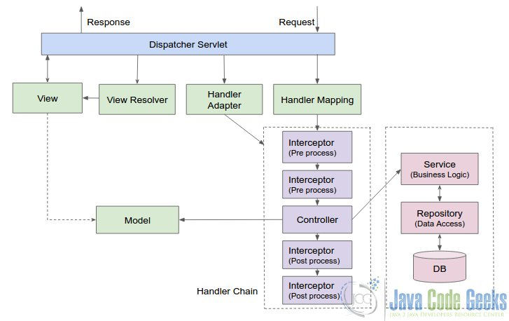
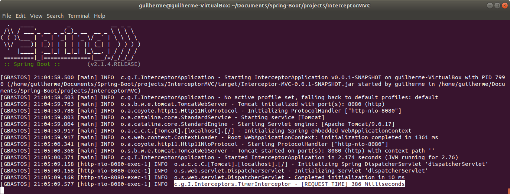

# Spring Boot Studies [](https://github.com/sindresorhus/awesome)
> This repository keeps evolving as I continue covering more functionalities and techniques from Spring boot application.

A generic repository for study purposes, with all the exercises from the https://www.tutorialspoint.com/spring_boot

[Get back to the main Summary Page.](https://github.com/guilhermeborgesbastos/Spring-Boot-Studies)

___


## More Interceptor samples.

In order to better understand it, we are going to exercise the Interceptor concepts in three different applications, they are `TimerInterceptor` and other two:

|  Source Code  | Interceptor    | Implementation Details |
| --------|---------|-------|
| [Read more](https://github.com/guilhermeborgesbastos/Spring-Boot-Studies/tree/LoggerInterceptor)   | LoggerInterceptor   |  In this example, we will use Interceptor focusing on logging in a web application.     |
| [Read more](https://github.com/guilhermeborgesbastos/Spring-Boot-Studies/tree/UserInterceptor)  | UserInterceptor | It's a more advanced example using interceptors emulating a session timeout logic by setting custom counters and tracking sessions manually.  |

| **IMPORTANT:** If you did not see the previous example [LoggerInterceptor](https://github.com/guilhermeborgesbastos/Spring-Boot-Studies/tree/LoggerInterceptor) and its theoretical concepts, make sure to read and practice it before to continue with this tutorial - TimerInterceptor. |
| --- |

# Spring Boot - Timer Interceptor

> In this tutorial, we’ll continue understanding the Spring MVC `HandlerInterceptor` to intercept Servlet Requests for tracking how long the Request will take in a web application.

Before to get hands dirty, let's dive deeper in some more explanations.

## Deeper overview of Spring MVC Architecture

Spring’s web MVC framework is *request-driven* and designed based on a central Servlet that dispatches requests to controllers and invokes other functionality that facilitates the development of web applications.

The request processing workflow of the Spring MVC `DispatcherServlet` is illustrated in the following diagram.



The `DispatcherServlet` is an actual Servlet and inherits from the `HttpServlet` base class. When a request is sent to the web application, the workflow of handling a request is as below:

1. When `DispatcherServlet` receives the request, it dispatches the task of selecting an appropriate controller to `HandlerMapping`. Then, `HandlerMapping` selects the controller which is mapped to the incoming request URL and returns the *(selected Handler)* and *Controller* to `DispatcherServlet`;
2. `DispatcherServlet` dispatches the task of executing the business logic by `Controller` to `HandlerAdapter`. `HandlerAdapter` calls the business logic process of `Controller`. When the `HandlerAdapter` calls the controller, `Interceptor` is invoked to intercept the request.
3. Then, `Controller` executes the business logic and sets the processing result in `Model`. Then, if there is any `Interceptor` to intercept the response, is invoked as a post process. Then `Controller` returns the logical name of view to `HandlerAdapter`.
4. `DispatcherServlet` dispatches the task of resolving the `View` corresponding to the View name to `ViewResolver`. `ViewResolver` returns the `View` mapped to View name.
5. `DispatcherServlet` dispatches the rendering process to returned `View`.
6. `View` renders `Model` data and returns the response.

##  What is the difference between Spring MVC Interceptor and Servlet Filter?

`HandlerInterceptor` is basically similar to a `Servlet 2.5 Filter`, but it just allows custom pre-processing with the option of prohibiting the execution of the Handler itself, and custom post-processing. Filters allow for exchanging the request and response objects that are passed to the chain. It means Filters work more in the request/response domain while HandlerInterceptors are spring bean and can access other beans in the application. Note that a Filter gets configured in `web.xml`, a `HandlerInterceptor` in the application context.


## Interceptor Usage Scenarios

In most programming paradigms, **interceptors are an essential part that enables programmers to control the execution by intercepting it**. Spring framework also supports a variety of interceptors for different purposes.

At this point you probably figured out that besides header modification, some of the other use-cases where a RestTemplate interceptor is useful are:

* Request and response logging;
* Retrying the requests with a configurable back off strategy;
* Request denial based on certain request parameters;
* Altering the request URL address.

# Getting hands dirty

## Custom Timer Interceptor

In this example we will focus on tracking how long the Request will take in a web application. Let's start by creating the `TimerInterceptor`, and of course, our class needs to extend the `HandlerInterceptorAdapter`:

```
package com.gbastos.InterceptorMVC.Interceptors;

public class TimerInterceptor extends HandlerInterceptorAdapter {
    ...
}
```

We also need to enable logging in our interceptor:

```	
private static Logger LOG = LoggerFactory.getLogger(TimerInterceptor.class);
```

This allows `Log4J` to display logs, as well as determine the time taken by the handler method to process a client’s request, logging it into the Log.

Next, let’s focus on custom interceptor implementations:

## Method *preHandle()*

This method is called before handling a request; it returns *true*, to allow the framework to send the request further to the handler method *(or to the next interceptor)*. If the method returns *false*, Spring assumes that request has been handled and no further processing is needed.

We will use the hook to set an attribute in the *HTTP Servlet Request* with the current time in milliseconds. The parameter was called `startedAt`, in the code below we will retrieve such attribute to calculate the Client's request time:

```
@Override
public boolean preHandle(
	final HttpServletRequest request,
	final HttpServletResponse response,
	final Object handler) throws Exception {
	
	final long startedAt = System.currentTimeMillis();
	request.setAttribute(STARTED_AT, startedAt);
	
	// Used to sleep the Thread for a random time in order to achieve randomicity in the Logging.
	TimerUtils.doThreadSleep();  // This method will be implemented in the next section...
	
	return true;
}
```

### Creating randomicity for testing purpose

Now let's implement the **static** method `doThreadSleep`. In our example, we created a separate file `TimerUtils` that would contain all the utilitarian methods:

```
package com.gbastos.InterceptorMVC.Utils;

public final class TimerUtils {

  /**
   * Do no instantiate the Utils class that only have Static method(s).
   */
  private TimerUtils() {
    super();
  }

  /**
   * Sleeps the Thread for a random time (500 Milliseconds).
   */
  public static void doThreadSleep() {

    try {

      Random rand = new Random();

      Thread.sleep(rand.nextInt(500));

    } catch (InterruptedException e) {
      e.printStackTrace();
    }
  }

}
```
The method `doThreadSleep` will sleep the Thread for a random time between 0 and 500 Milliseconds. In this way we are going to be able to see different request times for the same request.

See the entire Class [here](https://github.com/guilhermeborgesbastos/Spring-Boot-Studies/blob/TimerInterceptor/InterceptorMVC/src/main/java/com/gbastos/InterceptorMVC/Utils/TimerUtils.java).

## Method *postHandle()*

This hook runs when the HandlerAdapter is invoked the handler but DispatcherServlet is yet to render the view. In the implementation below we use it to determine the time taken by the handler method to process a client’s request, logging it into the Log:

```
@Override
public void postHandle(
  HttpServletRequest request, 
  HttpServletResponse response,
  Object handler, 
  ModelAndView modelAndView) throws Exception {
  
    final long startedAt = (long) request.getAttribute(STARTED_AT);
    request.removeAttribute(STARTED_AT);

    final long finishedAt = System.currentTimeMillis();
    final long requestTime = finishedAt - startedAt;

    LOG.info( LOG_PREFIX + requestTime + " Milliseconds");
}
```
**Note** - Since our `TimerInterceptor` extends the **abstract** class `HandlerInterceptorAdapter`, we may implement only required methods. In other hand, in case of implementing the `HandlerInterceptor` all three methods: `preHandle()`, `postHandle()` and `afterCompletion()` must be implemented.

## Configuration

To add the new `TimerInterceptor`  into Spring configuration, we need to override `addInterceptors()` method inside **WebConfig** class that implements `WebMvcConfigurer`:

```
@Override
public void addInterceptors(InterceptorRegistry registry) {
	// Other Interceptors here...
	registry.addInterceptor(new TimerInterceptor());
}
```

We may achieve the same configuration by editing our `XML Spring configuration`See the entire Class here. file:

```
<mvc:interceptors>
    <bean id="timerInterceptor" class="com.gbastos.InterceptorMVC.Interceptors.TimerInterceptor"/>
</mvc:interceptors>
```

With this configuration active, the interceptor will be active and all requests in the application will be properly timed:




**Note** - if multiple Spring interceptors are configured, the `preHandle()` method is executed in the order of configuration, whereas `postHandle()` and `afterCompletion()` methods are invoked in the reverse order.

See the entire configuration Class [here](https://github.com/guilhermeborgesbastos/Spring-Boot-Studies/blob/TimerInterceptor/InterceptorMVC/src/main/java/com/gbastos/InterceptorMVC/Spring/MvcConfig.java).

### Thank you!
