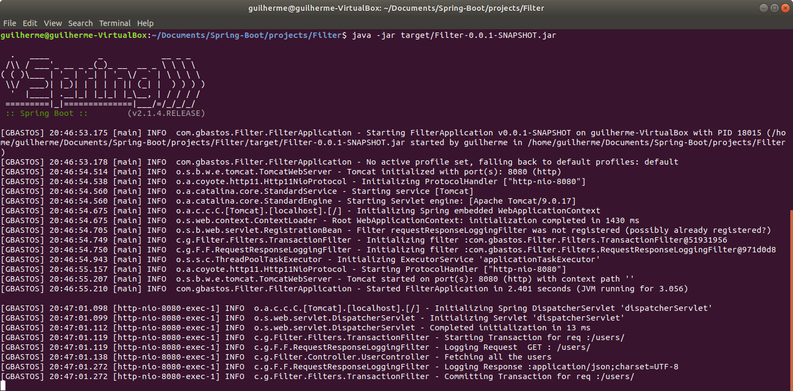

# Spring Boot Studies 
> This repository keeps evolving as I continue covering more functionalities and techniques from Spring boot application.

A generic repository for study purposes, with all the exercises from the https://www.tutorialspoint.com/spring_boot

[Get back to the main Summary Page.](https://github.com/guilhermeborgesbastos/Spring-Boot-Studies)

# Spring Boot - Servlet Filter

The `Filter` like the diagram above presents are pluggable, in other words, `Filters` acts independently in a very configurable way. So for each Servlet, you can set *Filters* that can maintain `Logging`, `Transaction` and/or `Authentication`. Any of the Filters between the *Request* and the *Servlet* can return the response back, denying the request prior to reaching the target Servlet.

The sequence of execution of the Filter(s) are handled by the `FilterChain`, that is an object provided by the `Servlet Container` to the developer giving a view into the invocation chain of a filtered request for a resource.

Let's exercise the concept using the diagram above for the `Request A`:

### **Request A - *Flow Description* **

1. The Client dispatches the request  to a specific Servlet, in case of the **Request A**, to the `Servelet A` but prior to reaching the Servlet itself there are two Filters configured in the Web Application, they are `Transaction Filter` and  `Auth Filter`;
2. The request will arrive at the first filter `Transaction Filter`, the filtering process implemented will be executed, in case of any objection, the Request will be denied and the response returned to the Client. In case of the `Transaction Filter` be executed with no objections, the method `doFilter()` from the `FilterChain` Object will be invoked, calling the next filter, in that case, the next filter been called would be the `Auth Filter`.
3. At this point the request will arrive at the second and last filter `Auth Filter`, the filtering process implemented will be executed, in case of any objection, the Request will be denied and the response returned to the Client. In case of the `Auth Filter` be executed with no objections, the method `doFilter()` from the `FilterChain` Object will be invoked, since there is no next filter in the `FilterChain` Object the `Servelet A` will be finally invoked.

## What is a Filter?

A **filter** is an object used to intercept the HTTP requests and responses of your application. By using filter, we can perform two operations at two instances −

* **Before** sending the **request** to the controller;
* **Before** sending the **response** to the client;

For example, you can use an Filter to add the read the remote host and remote address from the ServletRequest object before sending the request to the controller.	

The following are the three methods you should know about while working on Filters −

* `init()` method − *It is called by the web container to indicate to a filter that it is being placed into service. The servlet container calls the init method exactly once after instantiating the filter. The init method must complete successfully before the filter is asked to do any filtering work.*

* `doFilter()` method − *It is called by the container each time a request/response pair is passed through the chain due to a client request for a resource at the end of the chain. The FilterChain passed in to this method allows the Filter to pass on the request and response to the next entity in the chain.*

* `destroy()` method − *It is called by the web container to indicate to a filter that it is being taken out of service. This method is only called once all threads within the filter's doFilter method have exited or after a timeout period has passed. After the web container calls this method, it will not call the doFilter method again on this instance of the filter.*

## Spring HandlerInterceptor vs Servlet Filters

**HandlerInterceptor** is basically similar to a **Servlet 2.3 Filter**, but in contrast to the latter it just allows custom pre-processing with the option of prohibiting the execution of the handler itself, and custom post-processing. **Filters are more powerful**, for example they allow for exchanging the request and response objects that are handed down the chain. Note that a *Filter* gets configured in `web.xml`, a *HandlerInterceptor* in the `Application context`.

As a basic guideline, fine-grained handler-related preprocessing tasks are candidates for *HandlerInterceptor* implementations, especially factored-out common handler code and authorization checks. On the other hand, a *Filter* is well-suited for request content and view content handling, like multipart forms and GZIP compression. This typically shows when one needs to map the filter to certain content types (e.g. images), or to all requests.

*Filters* are more suitable when treating your `request/response` as a **black box** system. They'll work regardless of how the servlet is implemented.

If you're using Spring MVC, there's probably little reason to write new logic as a servlet filter. Everything filters can do, interceptors can do more easily and more elegantly. 

But like always, there are exceptions, e.g Frameworks that customize **ServletRequest** or **ServletResponse** method implementations use wrappers and require that a **Filter** be used. Spring *HandlerInterceptors* cannot do this by its own.

## Geeting your hands durty

In the repository it was implemented an Spring Boot project with two Filters:
- **1st** the `TransactionFilter`;
- **2nd** the `RequestResponseLoggingFilter`;

Both are configured in the same `Chain`. A controller `UserController` was created with a single route _GET `/users` in order to fire a request being able to debug and track the work being performed by the Filters.

