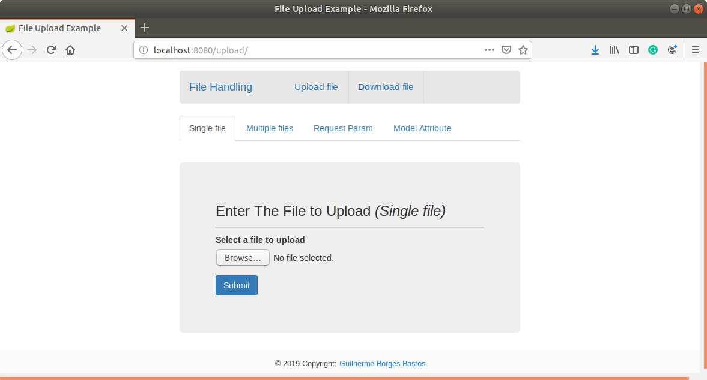
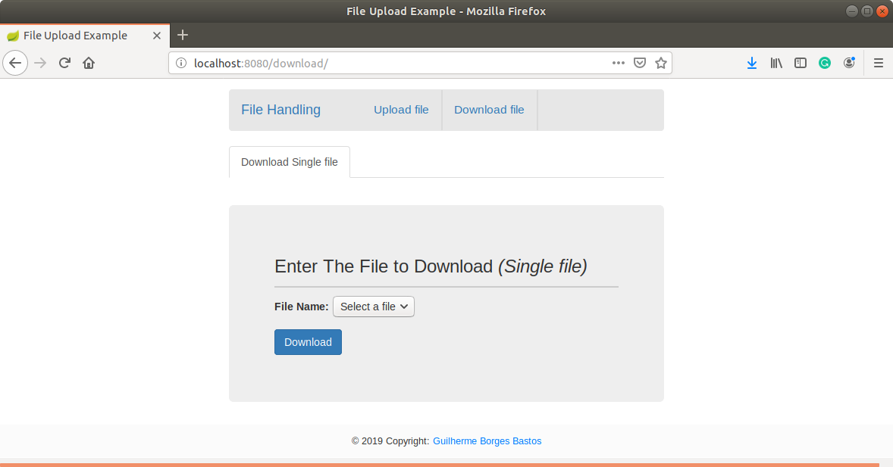

# Spring Boot Studies [](https://github.com/sindresorhus/awesome)
> This repository keeps evolving as I continue covering more functionalities and techniques from Spring boot application.

A generic repository for study purposes, with all the exercises from the https://www.tutorialspoint.com/spring_boot

[Get back to the main Summary Page.](https://github.com/guilhermeborgesbastos/Spring-Boot-Studies)

[](http://www.youtube.com/watch?v=4_mVGYfXX38 "Spring Boot Studies - File Handling")

# Spring Boot - File Handling using Thymeleaf

In this chapter, we will learn about the **Thymeleaf**, a java-based library used to create a web application. It provides a good support for serving a *XHTML/HTML5* in web applications. 

In the past, we have worked on the [File Handling](https://github.com/guilhermeborgesbastos/Spring-Boot-Studies/tree/FileHandling) application that was using the *Java Server Pages (JSPs)* that is one of the view technologies you can use with the Spring Framework. The goal for this chapter is to replace the *Java Server Pages (JSPs)* with the **Thymeleaf** into our  [File Handling](https://github.com/guilhermeborgesbastos/Spring-Boot-Studies/tree/FileHandling) application. In the end, we will have a fully functional application using the Thymeleaf library for serving a XHTML/HTML5 in an web application.

See the screenshots below of the final results -

### Upload page


### Download page



## Getting hands dirty

### Configuring the dependencies

First of all, let's add the configurations required to integrate with Spring. The thymeleaf-spring library is required for the integration.

Add the following dependencies to your Maven [POM](https://github.com/guilhermeborgesbastos/Spring-Boot-Studies/blob/ThymeleafTemplate/ThymeleafTemplate/pom.xml) file:
```xml
<dependency>
    <groupId>org.thymeleaf</groupId>
    <artifactId>thymeleaf</artifactId>
    <version>3.0.9.RELEASE</version>
</dependency>
<dependency>
    <groupId>org.thymeleaf</groupId>
    <artifactId>thymeleaf-spring4</artifactId>
    <version>3.0.9.RELEASE</version>
</dependency>
```

**Note** - *For a Spring 4 project, the `thymeleaf-spring4` library must be used instead of `thymeleaf-spring5`.*

### Thymeleaf configurations

The *SpringTemplateEngine* class performs all of the configuration steps. You can configure this class as a bean in the Java configuration file like done below:

```java
EnableWebMvc
@Configuration
@ComponentScan({"com.gbastos.ThymeleafTemplate"})
/**
 * Java configuration file that is used for Spring MVC and Thymeleaf configurations
 */
public class WebConfig implements WebMvcConfigurer, ApplicationContextAware {

  private static final Logger LOG = LoggerFactory.getLogger(WebConfig.class);

  private ApplicationContext applicationContext;
  
  @Value("${static.path}")
  private String staticPath;

  @Override
  public void setApplicationContext(ApplicationContext applicationContext) {
    this.applicationContext = applicationContext;
  }

  /**
   * Sets the HTML template resolver among with its configurations.
   *
   * @return the template resolver
   */
  private ITemplateResolver htmlTemplateResolver() {
    SpringResourceTemplateResolver resolver = new SpringResourceTemplateResolver();
    resolver.setApplicationContext(applicationContext);
    resolver.setPrefix("/view/");
    resolver.setCacheable(false);
    resolver.setTemplateMode(TemplateMode.HTML);
    return resolver;
  }

  /**
   * Sets the Javascript template resolver among with its configurations.
   *
   * @return the template resolver
   */
  private ITemplateResolver javascriptTemplateResolver() {
    SpringResourceTemplateResolver resolver = new SpringResourceTemplateResolver();
    resolver.setApplicationContext(applicationContext);
    resolver.setPrefix("/js/");
    resolver.setCacheable(false);
    resolver.setTemplateMode(TemplateMode.JAVASCRIPT);
    return resolver;
  }

  /**
   * Created the Template Engine instance to be used for processing templates.
   *
   * @return the  Sub-interface of {@link ITemplateEngine}
   */
  private ISpringTemplateEngine templateEngine(ITemplateResolver templateResolver) {
    SpringTemplateEngine engine = new SpringTemplateEngine();
    engine.addDialect(new LayoutDialect(new GroupingStrategy()));
    engine.addDialect(new Java8TimeDialect());
    engine.setTemplateResolver(templateResolver);
    engine.setTemplateEngineMessageSource(messageSource());
    return engine;
  }

  /**
   * Sets the Thymeleaf's view resolver for the HTML files.
   *
   * @return the view resolver
   */
  @Bean
  public ViewResolver htmlViewResolver() {
    ThymeleafViewResolver resolver = new ThymeleafViewResolver();
    resolver.setTemplateEngine(templateEngine(htmlTemplateResolver()));
    resolver.setContentType("text/html");
    resolver.setCharacterEncoding("UTF-8");
    resolver.setViewNames(ArrayUtil.array("*.html"));
    return resolver;
  }
  
  /**
   * Sets the Thymeleaf's view resolver for the Javascript files.
   *
   * @return the view resolver
   */
  @Bean
  public ViewResolver javascriptViewResolver() {
    ThymeleafViewResolver resolver = new ThymeleafViewResolver();
    resolver.setTemplateEngine(templateEngine(javascriptTemplateResolver()));
    resolver.setContentType("application/javascript");
    resolver.setCharacterEncoding("UTF-8");
    resolver.setViewNames(ArrayUtil.array("*.js"));
    return resolver;
  }
  
  @Bean
  @Description("Spring Message Resolver")
  public ResourceBundleMessageSource messageSource() {
    ResourceBundleMessageSource messageSource = new ResourceBundleMessageSource();
    messageSource.setBasename("messages");
    return messageSource;
  }

  @Bean
  public LocaleResolver localeResolver() {
    SessionLocaleResolver localeResolver = new SessionLocaleResolver();
    localeResolver.setDefaultLocale(new Locale("en"));
    return localeResolver;
  }

  @Bean
  public LocaleChangeInterceptor localeChangeInterceptor() {
    LocaleChangeInterceptor localeChangeInterceptor = new LocaleChangeInterceptor();
    localeChangeInterceptor.setParamName("lang");
    return localeChangeInterceptor;
  }

  @Override
  public void addInterceptors(InterceptorRegistry registry) {
    registry.addInterceptor(localeChangeInterceptor());
  }

  /**
   * Add handlers to serve static resources such as images, js, and, css files from specific
   * locations under web application root, the classpath, and others.
   *
   * @param registry
   */
  @Override
  public void addResourceHandlers(ResourceHandlerRegistry registry) {
    registry.addResourceHandler("/webjars/**").addResourceLocations("/webjars/");
    if (staticPath != null) {
      LOG.info("Serving static content from: " + staticPath);
      registry.addResourceHandler("/**").addResourceLocations("file:" + staticPath);
    }
  }
}
```

**Note** - *All the dependencies used in the configuration file above can be found at the repository -* [See the configuration source file](https://github.com/guilhermeborgesbastos/Spring-Boot-Studies/blob/ThymeleafTemplate/ThymeleafTemplate/src/main/java/com/gbastos/ThymeleafTemplate/config/WebConfig.java)

### Replacing the *Java Server Pages (JSPs)* with the **Thymeleaf**  syntax

The *Thymeleaf* library it's a world of possibilities by its own, it does not seem reasonable to write the syntax and the usage of all the possibilities and usages of the library, that would be out of the scope, the goal here is to present the library with a fully functional usage, that is what we are doing here.

Below are the templates that were refactored from the original project (File Handling) which were using JSP instead of the Thymeleaf:

<details><summary><b>fileDownloadForm.html</b></summary>
<p>

#### Template source [Link](https://github.com/guilhermeborgesbastos/Spring-Boot-Studies/blob/ThymeleafTemplate/ThymeleafTemplate/src/main/resources/templates/fileDownloadForm.html)

```html
<!DOCTYPE html>
<html xmlns:th="http://www.thymeleaf.org"
	th:with="lang=${#locale.language}" th:lang="${lang}">
<head>
	<title>File Upload Example</title>
	<script th:src="@{/webjars/jquery/3.1.1/jquery.min.js}"></script>
	<script th:src="@{/webjars/bootstrap/3.3.7-1/js/bootstrap.min.js}"></script>
	<link rel="stylesheet" th:href="@{/webjars/bootstrap/3.3.7-1/css/bootstrap.min.css}" />
	<link rel="stylesheet" th:href="@{/css/main.css}"/>
</head>
<body>

	<div class="row">
		<div class="col-sm-3"></div>
		<div class="col-sm-6">
			<div th:replace="fragment/nav">...</div>
		</div>
		<div class="col-sm-3"></div>
	</div>

	<div class="row">

		<div class="col-sm-3"></div>

		<div class="col-sm-6">

			<ul class="nav nav-tabs">
				<li class="active"><a data-toggle="tab" href="#single-file">Download
						Single file</a></li>
			</ul>

		</div>

		<div class="col-sm-3"></div>

	</div>

	<div class="row">

		<div class="col-sm-3"></div>

		<div class="col-sm-6">

			<div class="tab-content">

				<div id="single-file" class="tab-pane fade in active">

					<div class="container">

						<div class="jumbotron">

							<h3>
								Enter The File to Download <i>(Single file)</i>
							</h3>
							
							<form method="POST" action="/download/file" enctype="multipart/form-data">

								<div class="form-group">
									<label for="fileName">File Name:</label>
									<span th:if="${files==null || files.isEmpty()}">No file uploaded yet.</span>
									<select class="browser-default custom-select" name="fileName"
										th:unless="${files==null || files.isEmpty()}">
										<option
											th:each="file : ${files}"
											th:value="${file}"
											th:text="${file}">Select a file</option>
									</select>

								</div>

								<button type="submit" class="btn btn-primary"
									th:disabled="${files==null || files.isEmpty()}">Download</button>

							</form>
							
						</div>

					</div>

				</div>

			</div>

		</div>

		<div class="col-sm-3"></div>

	</div>

	<div th:replace="fragment/footer">...</div>

</body>
</html>
```

</p>
</details>

---

<details><summary><b>fileUploadForm.html</b></summary>
<p>

#### Template source [Link](https://github.com/guilhermeborgesbastos/Spring-Boot-Studies/blob/ThymeleafTemplate/ThymeleafTemplate/src/main/resources/templates/fileUploadForm.html)

```html
<!DOCTYPE html>
<html xmlns:th="http://www.thymeleaf.org"
	th:with="lang=${#locale.language}" th:lang="${lang}">
<head>
	<title>File Upload Example</title>
	<script th:src="@{/webjars/jquery/3.1.1/jquery.min.js}"></script>
	<script th:src="@{/webjars/bootstrap/3.3.7-1/js/bootstrap.min.js}"></script>
	<script th:src="@{/js/main.js}"></script>
	<link rel="stylesheet" th:href="@{/webjars/bootstrap/3.3.7-1/css/bootstrap.min.css}" />
	<link rel="stylesheet" th:href="@{/css/main.css}"/>
</head>
<body>

	<div class="row">
		<div class="col-sm-3"></div>			
		<div class="col-sm-6">
			<div th:replace="fragment/nav">...</div>
		</div>
		<div class="col-sm-3"></div>
	</div>
	
	<div class="row">
		
		<div class="col-sm-3"></div>
		
			<div class="col-sm-6">
			
			<ul class="nav nav-tabs">
				<li class="active"><a data-toggle="tab" href="#single-file">Single file</a></li>
				<li><a data-toggle="tab" href="#multiple-files">Multiple files</a></li>
				<li><a data-toggle="tab" href="#multipart-form-data-request-param">Request Param</a></li>
				<li><a data-toggle="tab" href="#multipart-form-data-model-attribute">Model Attribute</a></li>
			</ul>
		
		</div>
		
		<div class="col-sm-3"></div>
	
	</div>

	<div class="row">
		
		<div class="col-sm-3"></div>
		
			<div class="col-sm-6">
			
			<div class="tab-content">
			
				<div id="single-file" class="tab-pane fade in active">

					<div class="container">
						
						<div class="jumbotron">
							
							<h3>Enter The File to Upload <i>(Single file)</i></h3>

							<form method="POST" action="/upload/uploadFile" enctype="multipart/form-data">
								
								 <div class="form-group">
								 
									 <label for="file">Select a file to upload</label>
									 <input type="file" name="file" />
								 
								 </div>
								 
								 <button type="submit" class="btn btn-primary">Submit</button>
								
							</form>
							
						</div>
						
					</div>
					
				</div>
				
				<div id="multiple-files" class="tab-pane fade">
					
					<div class="container">
						
						<div class="jumbotron">

							<h3>Enter The Files to Upload <i>(Multiple files)</i></h3>

							<form method="POST" action="/upload/uploadMultiFile" enctype="multipart/form-data">

								 <div class="form-group">
										<label for="files">Select a file to upload</label>
										<input type="file" name="files" />
								 </div>
								 <div class="form-group">
										<label for="files">Select a file to upload</label>
										<input type="file" name="files" />
								 </div>
								 <div class="form-group">
										<label for="files">Select a file to upload</label>
										<input type="file" name="files" />
								 </div>

								 <button type="submit" class="btn btn-primary">Submit</button>
								 
							</form>
						
						</div>
					
					</div>
					
				</div>
				
				<div id="multipart-form-data-request-param" class="tab-pane fade">
					
					<div class="container">
						
						<div class="jumbotron">
							
							<h3>Fill the Form and Select a File (<code>@RequestParam</code>)</h3>

							<form method="POST" action="/upload/uploadFileWithAdditionalData" enctype="multipart/form-data">
							
								    <div class="form-group">
										<label for="name">Name:</label>
										<input type="text" name="name" />
									</div>
									<div class="form-group">
										<label for="email">Email:</label>
										<input type="text" name="email" />
									</div>
									<div class="form-group">
										<label for="file">Select a file to upload</label>
										<input type="file" name="file" />
									</div>

								 	<button type="submit" class="btn btn-primary">Submit</button>

							</form>
							
						</div>
					
					</div>
					
				</div>
				
				<div id="multipart-form-data-model-attribute" class="tab-pane fade">
			
					<div class="container">
						
						<div class="jumbotron">
							
							<h3>Fill the Form and Select a File (<code>@ModelAttribute</code>)</h3>
							
							<form method="POST" action="/upload/uploadFileModelAttribute" enctype="multipart/form-data">
							
								 	<div class="form-group">
										<label for="name">Name:</label>
										<input type="text" name="name" />
									</div>
									 <div class="form-group">
										<label for="email">Email:</label>
										<input type="text" name="email" />
									</div>
									 <div class="form-group">
										<label for="file">Select a file to upload</label>
										<input type="file" name="file" />
									</div>

								 	<button type="submit" class="btn btn-primary">Submit</button>

							</form>

						</div>

					</div>

				</div>

			</div>

		</div>

		<div class="col-sm-3"></div>

	</div>

	<div th:replace="fragment/footer">...</div>

</body>
</html>
```

</p>
</details>

---


<details><summary><b>fileUploadView.html</b></summary>
<p>

#### Template source [Link](https://github.com/guilhermeborgesbastos/Spring-Boot-Studies/blob/ThymeleafTemplate/ThymeleafTemplate/src/main/resources/templates/fileUploadView.html)

```html
<!DOCTYPE html>
<html xmlns:th="http://www.thymeleaf.org"
	th:with="lang=${#locale.language}" th:lang="${lang}">
	<head>
		<title>File Upload Example</title>
		<script th:src="@{/webjars/jquery/3.1.1/jquery.min.js}"></script>
		<script th:src="@{/webjars/bootstrap/3.3.7-1/js/bootstrap.min.js}"></script>
		<script th:src="@{/js/main.js}"></script>
		<link rel="stylesheet" th:href="@{/webjars/bootstrap/3.3.7-1/css/bootstrap.min.css}" />
		<link rel="stylesheet" th:href="@{/css/main.css}"/>
	</head>
	<body>
	
		<div class="row">			
			<div class="col-sm-3"></div>			
			<div class="col-sm-6">
				<div th:replace="fragment/nav">...</div>
			</div>
			<div class="col-sm-3"></div>
		</div>
		
		<div class="row">
			
			<div class="col-sm-3"></div>
			
				<div class="col-sm-6">
				
					<div class="container">
					
						<div class="jumbotron uploadFile" th:if="${requestURI == 'uploadFile'}">				
							<h2>Submitted File <i>(Single)</i></h2>
							<div class="well well-sm">
								<p class="property">Original File Name:</p>
								<p th:text="${file.originalFilename}">...</p>
							</div>
							<div class="well well-sm">
								<p class="property">Type:</p>
								<p th:text="${file.contentType}">...</p>
							</div>
						</div>

						<div class="jumbotron uploadMultiFile" th:if="${requestURI == 'uploadMultiFile'}">
							<h2>Submitted Files <i>(Multiple)</i></h2>							
							<div class="well well-sm" th:each="file : ${files}">
								<p class="property">Original File Name:</p>
								<p th:text="${file.originalFilename}">...</p>
								<p class="property">Type:</p>
								<p th:text="${file.contentType}">...</p>
							</div>
						</div>

						<div class="jumbotron uploadFileWithAdditionalData" th:if="${requestURI == 'uploadFileWithAdditionalData'}">	
							<h2>Submitted File with Data (<code>@RequestParam</code>)</h2>
							<div class="well well-sm">
								<p class="property">Name:</p>
								<p th:text="${name}">...</p>
							</div>
							<div class="well well-sm">
								<p class="property">Email:</p>
								<p th:text="${email}">...</p>
							</div>
							<div class="well well-sm">
								<p class="property">Original File Name:</p>
								<p th:text="${file.originalFilename}">...</p>
							</div>
							<div class="well well-sm">
								<p class="property">Type:</p>
								<p th:text="${file.contentType}">...</p>
							</div>
						</div>

						<div class="jumbotron uploadFileModelAttribute" th:if="${requestURI == 'uploadFileModelAttribute'}">
							<h2>Submitted File with Data (<code>@ModelAttribute</code>)</h2>
							<div class="well well-sm">
								<p class="property">Name:</p>
								<p th:text="${formDataWithFile.name}">...</p>
							</div>
							<div class="well well-sm">
								<p class="property">Email:</p>
								<p th:text="${formDataWithFile.email}">...</p>
							</div>
							<div class="well well-sm">
								<p class="property">Original File Name:</p>
								<p th:text="${formDataWithFile.file.originalFilename}">...</p>
							</div>
							<div class="well well-sm">
								<p class="property">Type:</p>
								<p th:text="${formDataWithFile.file.contentType}">...</p>
							</div>
						</div>
					
					</div>
					
				</div>
	
			</div>
			
			<div th:replace="fragment/footer">...</div>
				
	</body>
</html>
```

</p>
</details>

---

<details><summary><b>footer.html</b></summary>
<p>

#### Template source [Link](https://github.com/guilhermeborgesbastos/Spring-Boot-Studies/blob/ThymeleafTemplate/ThymeleafTemplate/src/main/resources/templates/fragment/footer.html)

```html
<!DOCTYPE html>
<html xmlns:th="http://www.thymeleaf.org">
<body>

	<!-- Footer -->
	<footer class="page-footer" th:fragment="footer">
	
	    <!-- Copyright -->
	    <div class="footer-copyright">&copy; 2019 Copyright:
	        <a href="https://www.linkedin.com/in/guilhermeborgesbastos/"> Guilherme Borges Bastos</a>
	    </div>
	    <!-- Copyright -->
	
	</footer>
	<!-- Footer -->

</body>
</html>
```

</p>
</details>

---

<details><summary><b>nav.html</b></summary>
<p>

#### Template source [Link](https://github.com/guilhermeborgesbastos/Spring-Boot-Studies/blob/ThymeleafTemplate/ThymeleafTemplate/src/main/resources/templates/fragment/nav.html)

```html
<!DOCTYPE html>
<html xmlns:th="http://www.thymeleaf.org">
	<body>
		<nav class="navbar" th:fragment="nav">
		
		    <!-- Brand/logo -->
		    <a class="navbar-brand" href="/upload/">File Handling</a>
		
		    <ul class="navbar-nav">
		        <li class="nav-item">
		            <a class="nav-link" href="/upload/">Upload file</a>
		        </li>
		        <li class="nav-item">
		            <a class="nav-link" href="/download/">Download file</a>
		        </li>
		    </ul>
		</nav>
	</body>
</html>
```

</p>
</details>

---

### Useful Sources

Those articles have helped me at fist time to better understand and apply the changes needed to replace the JSP templates with the Thymeleaf. Hopefully, they end up being useful for you as well:

- Introduction to Using Thymeleaf in Spring - [See Arthicle](https://www.baeldung.com/thymeleaf-in-spring-mvc)
- Working with Select and Option in Thymeleaf - [See Arthicle](https://www.baeldung.com/thymeleaf-select-option)
- Conditionals in Thymeleaf - [See Arthicle](https://www.baeldung.com/spring-thymeleaf-conditionals)
- Thymeleaf Page Layouts - [See Arthicle](https://www.thymeleaf.org/doc/articles/layouts.html)
- Spring Boot CRUD Application with Thymeleaf - [See Arthicle](https://www.baeldung.com/spring-boot-crud-thymeleaf)
- Working With Custom HTML Attributes in Thymeleaf - [See Arthicle](https://www.baeldung.com/thymeleaf-custom-html-attributes)
- Spring with Thymeleaf Pagination for a List - [See Arthicle](https://www.baeldung.com/spring-thymeleaf-pagination)
- Working With Custom HTML Attributes in Thymeleaf - [See Arthicle](https://www.baeldung.com/thymeleaf-custom-html-attributes)
- Working With Arrays in Thymeleaf - [See Arthicle](https://www.baeldung.com/thymeleaf-arrays)
- Iteration in Thymeleaf - [See Arthicle](https://www.baeldung.com/thymeleaf-iteration)
- Working with Boolean in Thymeleaf - [See Arthicle](https://www.baeldung.com/thymeleaf-boolean)
- Working with Fragments in Thymeleaf - [See Arthicle](https://www.baeldung.com/spring-thymeleaf-fragments)
- Spring Security with Thymeleaf - [See Arthicle](https://www.baeldung.com/spring-security-thymeleaf)