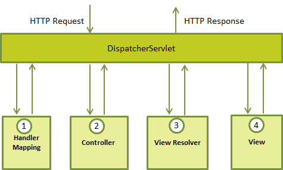

# Spring Boot Studies [](https://github.com/sindresorhus/awesome)
> This repository keeps evolving as I continue covering more functionalities and techniques from Spring boot application.

A generic repository for study purposes, with all the exercises from the https://www.tutorialspoint.com/spring_boot

[Get back to the main Summary Page.](https://github.com/guilhermeborgesbastos/Spring-Boot-Studies)

___


## More Interceptor samples.

In order to better understand it, we are going to exercise the Interceptor concepts in three different applications, they are:

|  Source Code  | Interceptor    | Implementation Details |
| --------|---------|-------|
| [Read more](https://github.com/guilhermeborgesbastos/Spring-Boot-Studies/tree/LoggerInterceptor)   | LoggerInterceptor   |  In this example, we will use Interceptor focusing on logging in a web application.     |
| [Read more](https://github.com/guilhermeborgesbastos/Spring-Boot-Studies/tree/TimerInterceptor)  | TimerInterceptor |  In this example, we will use Interceptor for tracking how long the Request will take in a web application.   |
| [Read more](https://github.com/guilhermeborgesbastos/Spring-Boot-Studies/tree/UserInterceptor)  | UserInterceptor | It's a more advanced example using interceptors emulating a session timeout logic by setting custom counters and tracking sessions manually.  |


# Spring Boot - Logger Interceptor

> In this tutorial, we’ll focus on understanding the Spring MVC HandlerInterceptor to intercept Servlet Requests logging it into the Logs.

## Spring MVC Handler

In order to better understand the interceptor, let’s take a look at the `HandlerMapping`. This maps a method to an URL, so that the `DispatcherServlet` will be able to invoke it when processing a request.

And the `DispatcherServlet` uses the `HandlerAdapter` to actually invoke the method.

Now that we understand the overall context – **this is where the handler interceptor comes in.** We’ll use the `HandlerInterceptor` to perform actions before handling, after handling or after completion _(when the view is rendered)_ of a request.

The interceptor can be used for _cross-cutting concerns_ (AOP) and to avoid repetitive handler code like: logging, changing globally used parameters in Spring model etc.

In next few sections that’s exactly what we’re going to be looking at – the differences between various interceptor implementations.



## Setup Maven Dependencies

In order to use Interceptors, you need to include the following section in a dependencies section of your [pom.xml](https://github.com/guilhermeborgesbastos/Spring-Boot-Studies/blob/LoggerInterceptor/InterceptorMVC/pom.xml)  file:

```
<dependency>
	<groupId>org.springframework.boot</groupId>
	<artifactId>spring-boot-starter-web</artifactId>
</dependency>

<dependency>
	<groupId>org.springframework</groupId>
	<artifactId>spring-web</artifactId>
</dependency>
	
<dependency>
	<groupId>ch.qos.logback</groupId>
	<artifactId>logback-classic</artifactId>
</dependency>

<dependency>
	<groupId>com.google.guava</groupId>
	<artifactId>guava</artifactId>
</dependency>
```

**Note** - All the Interceptor's projects are using Logback as the Logging Framework, know more how use it [here](https://github.com/guilhermeborgesbastos/Spring-Boot-Studies/tree/Logging).

## Spring Handler Interceptor Theory

Interceptors working with the `HandlerMapping` on the framework must implement the `HandlerInterceptor` interface.

This interface contains three main methods:

* `prehandle()` – *called before the actual handler is executed, but the view is not generated yet. In this project, it's in charge of logging some properties from the HTTP Servlet request;*
* `postHandle()` – *called after the handler is executed;*
* `afterCompletion()` – *called after the complete request has finished and view was generated. In this project, it's in charge of Log exceptions in case of an exception occurred;*

These three methods provide flexibility to do all kinds of `pre-` and `post-processing`.

**Note** – the main difference between `HandlerInterceptor` and `HandlerInterceptorAdapter` is that in the first one we need to override all three methods: `preHandle()`, `postHandle()` and `afterCompletion()`, whereas in the second we may implement only required methods.

**A quick note before we go further – if you want to skip the theory and jump straight to examples, jump right into section - [Getting hands dirty](#getting-hands-dirty).**

Here’s what a simple `preHandle()` implementation will look like:

```
@Override
public boolean preHandle(
  HttpServletRequest request,
  HttpServletResponse response, 
  Object handler) throws Exception {
    // Your implementation...
    return true;
}
```

Notice the method returns a *boolean* value – which tells Spring if the request should be further processed by a handler (*true*) or not (*false*).

Next, we have an implementation of `postHandle()`:

```
@Override
public void postHandle(
  HttpServletRequest request, 
  HttpServletResponse response,
  Object handler, 
  ModelAndView modelAndView) throws Exception {
    // Your implementation...
}
```

**This method is called immediately after the request is processed by HandlerAdapter, but before generating a view.**

And it can of course be used in many ways – for example, we may add an avatar of a logged user into a model.

The final method we need to implement in the custom `HandlerInterceptor` implementation is `afterCompletion()`:

```
@Override
public void afterCompletion(
  HttpServletRequest request, 
  HttpServletResponse response,
  Object handler, Exception ex) {
    // Your implementation...
}
```

When the **view** is successfully generated, we can use this hook to do things like gather additional statistics related to the request.

A final note to remember is that a `HandlerInterceptor` is registered to the `DefaultAnnotationHandlerMapping` bean, which is responsible for applying interceptors to any class marked with a `@Controller` annotation. Moreover, you may specify any number of interceptors in your web application.

# Getting hands dirty

## Custom Logger Interceptor

In this example we will focus on logging in our web application. First of all, our class needs to extend HandlerInterceptorAdapter:

```
package com.gbastos.InterceptorMVC.Interceptors;

public class LoggerInterceptor extends HandlerInterceptorAdapter {
    ...
}
```

We also need to enable logging in our interceptor:

```	
private static Logger log = LoggerFactory.getLogger(LoggerInterceptor.class);
```

This allows `Log4J` to display logs, as well as indicate, which class is currently logging information to the specified output.

Next, let’s focus on custom interceptor implementations:

## Method *preHandle()*

This method is called before handling a request; it returns *true*, to allow the framework to send the request further to the handler method *(or to the next interceptor)*. If the method returns *false*, Spring assumes that request has been handled and no further processing is needed.

We can use the hook to log information about the requests’ parameters: where the request comes from, etc.

In our example, we are logging this info using a simple `Log4J` logger:

```
@Override
public boolean preHandle(final HttpServletRequest request, final HttpServletResponse response, final Object handler)  throws Exception {
	LOG.info("[preHandle][" + request + "]" + "[" + request.getMethod() + "]" + request.getRequestURI() + getParameters(request));
	return true;
}
```

As we can see, we’re logging some basic information about the request.


### Filtering out private data

In case we run into private data, such as a password, we’ll need to make sure we don’t log that.

A simple option is to replace *passwords*, and any other sensitive type of data, with stars.

Here’s a quick implementation of how that can be done:

```
/**
 * Gets the parameters from the HTTP Servlet Request.
 * 
 * In case we run into a password here, we’ll need to make sure we don’t log that of course. A
 * simple option is to replace passwords, and any other sensitive type of data, with stars.
 *
 * @param request
 * @return the parameters request
 */
private String getParameters(final HttpServletRequest request) {
  
  final StringBuffer posted = new StringBuffer();
  final Enumeration<?> e = request.getParameterNames();
  
  if (e != null) {
    posted.append("?");
  }
  
  while (e != null && e.hasMoreElements()) {
    
    if (posted.length() > 1) {
      posted.append("&");
    }
    
    final String curr = (String) e.nextElement();
    posted.append(curr).append("=");
    
    if (PASS_ARGS.contains(curr)) {
      posted.append("*****");
    } else {
      posted.append(request.getParameter(curr));
    }
    
  }

  final String ip = request.getHeader("X-FORWARDED-FOR");
  final String ipAddr = (ip == null) ? getRemoteAddr(request) : ip; // Methods implementation in the next section.
  
  if (!Strings.isNullOrEmpty(ipAddr)) {
    posted.append("&_psip=" + ipAddr);
  }
  
  return posted.toString();
}
```

### Getting IP Address

Finally, we’re aiming to get the source IP address of the HTTP request.

Here’s a simple implementation:

```
/**
* Gets the remote address from the HTTP Servlet Request.
*
* @param request
* @return the remote address - IP
*/
private String getRemoteAddr(final HttpServletRequest request) {

	final String ipFromHeader = request.getHeader("X-FORWARDED-FOR");

	if (ipFromHeader != null && ipFromHeader.length() > 0) {
		LOG.debug("IP from proxy - X-FORWARDED-FOR : " + ipFromHeader);
		return ipFromHeader;
	}

	return request.getRemoteAddr();
}
```

See the entire Class [here](https://github.com/guilhermeborgesbastos/Spring-Boot-Studies/blob/LoggerInterceptor/InterceptorMVC/src/main/java/com/gbastos/InterceptorMVC/Interceptors/LoggerInterceptor.java).

## Method *postHandle()*

This hook runs when the HandlerAdapter is invoked the handler but DispatcherServlet is yet to render the view.

We can use this method to add additional attributes to the ModelAndView or to determine the time taken by handler method to process a client’s request.

In our case, we simply log a request just before DispatcherServlet is going to render a view.

```
@Override
public void postHandle(
  HttpServletRequest request, 
  HttpServletResponse response,
  Object handler, 
  ModelAndView modelAndView) throws Exception {
     
    LOG.info("[postHandle][" + request + "]");
}
```

## Method *afterCompletion()*

When a request is finished and the view is rendered, we may obtain request and response data, as well as information about exceptions, if any occurred:

```
@Override
public void afterCompletion(
  HttpServletRequest request,
  HttpServletResponse response,
  Object handler,
  Exception ex) throws Exception {
  
    if (ex != null){
        ex.printStackTrace();
    }
    
    LOG.info("[afterCompletion][" + request + "][exception: " + ex + "]");
}
```

## Configuration

To add our interceptors into Spring configuration, we need to override `addInterceptors()` method inside **WebConfig** class that implements `WebMvcConfigurer`:

```
@Override
public void addInterceptors(InterceptorRegistry registry) {
    registry.addInterceptor(new LoggerInterceptor());
}
```

We may achieve the same configuration by editing our `XML Spring configuration`See the entire Class here. file:

```
<mvc:interceptors>
    <bean id="loggerInterceptor" class="com.gbastos.InterceptorMVC.Interceptors.LoggerInterceptor"/>
</mvc:interceptors>
```

With this configuration active, the interceptor will be active and all requests in the application will be properly logged.

**Note** - if multiple Spring interceptors are configured, the `preHandle()` method is executed in the order of configuration, whereas `postHandle()` and `afterCompletion()` methods are invoked in the reverse order.

See the entire Class [here](https://github.com/guilhermeborgesbastos/Spring-Boot-Studies/blob/LoggerInterceptor/InterceptorMVC/src/main/java/com/gbastos/InterceptorMVC/Spring/MvcConfig.java).

### Thank you!