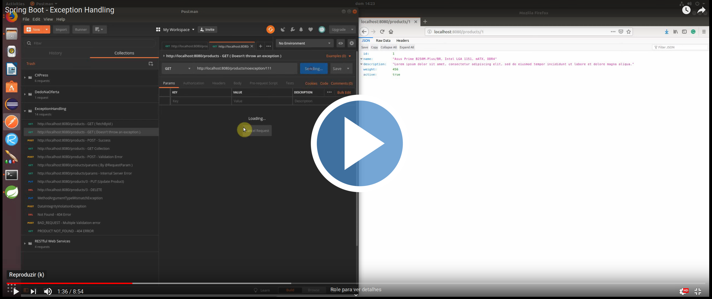
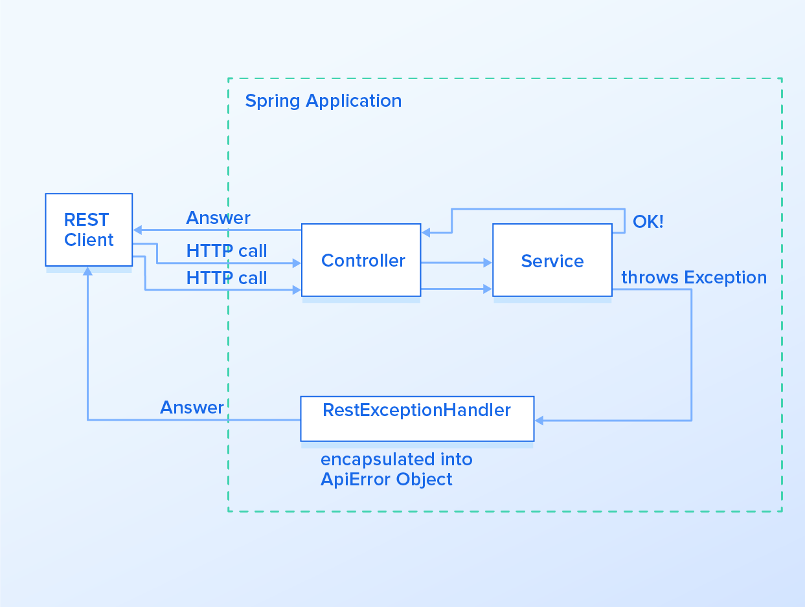

# Spring Boot Studies [](https://github.com/sindresorhus/awesome)
> This repository keeps evolving as I continue covering more functionalities and techniques from Spring boot application.

A generic repository for study purposes, with all the exercises from the https://www.tutorialspoint.com/spring_boot

[Get back to the main Summary Page.](https://github.com/guilhermeborgesbastos/Spring-Boot-Studies)


# Spring Boot - Exception Handling


Handling errors correctly in APIs while providing meaningful error messages is a very desirable feature, as it can help the API client properly respond to issues. The default behavior tends to be returning stack traces that are hard to understand and ultimately useless for the API client. Partitioning the error information into fields also enables the API client to parse it and provide better error messages to the user. In this article, we will cover how to do proper error handling when building a REST API with *Spring Boot*.

In this chapter, we will learn how to handle exceptions in Spring Boot. The video below presents an overview of a RESTful API handling generic and specific exceptions sending the proper response to the client. Take a look -

## Video Preview
[](https://youtu.be/vJ56dPV0Q0w)

___

## Flow

The following schema represents how the Application present in this article works -



___


Before proceeding with the coding, let us gain an understanding of the following annotations.

## @RestController

The `@RestController` is a base annotation for classes that handle REST operations. [Read more](https://www.baeldung.com/spring-controller-vs-restcontroller).

## @ExceptionHandler

The `@ExceptionHandler` is a Spring annotation that provides a mechanism to treat exceptions that are thrown during execution of handlers *(Controller operations)*. This annotation, if used on methods of controller classes, will serve as the entry point for handling exceptions thrown within this controller only. Altogether, the most common way is to use `@ExceptionHandler` on methods of `@ControllerAdvice` classes so that the exception handling will be applied globally or to a subset of controllers. [Read more](https://docs.spring.io/spring/docs/current/javadoc-api/org/springframework/web/bind/annotation/ExceptionHandler.html)

## @ControllerAdvice

The `@ControllerAdvice` is an annotation, to handle the exceptions globally. It was first introduced in **Spring 3.2**. It allows you to handle exceptions across the whole application, not just to an individual controller. You can think of it as an interceptor of exceptions thrown by methods annotated with `@RequestMapping` or one of the [shortcuts](https://www.baeldung.com/spring-new-requestmapping-shortcuts). 

In this way we can in just one place define how to treat such an exception and this handler will be called when the exception is thrown from classes that are covered by this `ControllerAdvice`. The subset of controllers affected can defined by using the following selectors on `@ControllerAdvice`: `annotations()`, `basePackageClasses()`, and `basePackages()`. If no selectors are provided, then the `ControllerAdvice` is applied globally to all controllers.

In other words, by using `@ExceptionHandler` and `@ControllerAdvice`, we’ll be able to define an unique point for treating exceptions and wrapping them up in an `ApiError` object with better organization than the default *Spring Boot* error handling mechanism.

## Exception Handler

Developers noticed the application crashed in some cases. For example, when retrieving details of a non-existing *user/product* or creating a *publication/comment* with inappropriate content. 

For overcoming this problem we can to create the class that will handle the exceptions. For simplicity, we are calling it `RestExceptionHandler` and it must extend from Spring Boot’s `ResponseEntityExceptionHandler`. We’ll be extending `ResponseEntityExceptionHandler` as it already provides some basic handling of *Spring MVC* exceptions, so we’ll be adding handlers for new exceptions while improving the existing ones.

### Overriding Exceptions Handled In ResponseEntityExceptionHandler

If you take a look into the source code of `ResponseEntityExceptionHandler`, you’ll see a lot of methods called `handle******()` like `handleHttpMessageNotReadable()` or `handleHttpMessageNotWritable()`. Let’s first see how can we extend `handleHttpMessageNotReadable()` to handle `HttpMessageNotReadableException` exceptions. We just have to override the method `handleHttpMessageNotReadable()` in our `RestExceptionHandler` class -

```
@Order(Ordered.HIGHEST_PRECEDENCE)
@ControllerAdvice
public class RestExceptionHandler extends ResponseEntityExceptionHandler {

   @Override
   protected ResponseEntity<Object> handleHttpMessageNotReadable(HttpMessageNotReadableException ex, HttpHeaders headers, HttpStatus status, WebRequest request) {
       String error = "Malformed JSON request";
       return buildResponseEntity(new ApiError(HttpStatus.BAD_REQUEST, error, ex));
   }

   private ResponseEntity<Object> buildResponseEntity(ApiError apiError) {
       return new ResponseEntity<>(apiError, apiError.getStatus());
   }

   // Continue with the other exception handlers below...

}
```
*See the complete file on [GitHub](https://github.com/guilhermeborgesbastos/Spring-Boot-Studies/blob/ExceptionHandling/ExceptionHandling/src/main/java/com/gbastos/ExceptionHandling/RestExceptionHandler.java)*

We have declared that in case of a `HttpMessageNotReadableException` being thrown, the error message will be *“Malformed JSON request”* and the error will be encapsulated inside the `ApiError` object. Below we can see the answer of a REST call with this new method overridden -

```
{
    "apiError": {
        "status": "BAD_REQUEST",
        "statusCode": 400,
        "timestamp": "21-04-2019 11:37:51",
        "message": "Malformed JSON request",
        "debugMessage": "JSON parse error: Cannot deserialize value of type `java.lang.Boolean` from String \"bla bla bla\": only \"true\" or \"false\" recognized; nested exception is com.fasterxml.jackson.databind.exc.InvalidFormatException: Cannot deserialize value of type `java.lang.Boolean` from String \"bla bla bla\": only \"true\" or \"false\" recognized\n at [Source: (PushbackInputStream); line: 5, column: 12] (through reference chain: com.gbastos.ExceptionHandling.Model.Product[\"active\"])"
    }
}
```

## Custom Exception Handler

Let's see how to create a method that handles an exception that is not yet declared inside Spring Boot’s `ResponseEntityExceptionHandler`.

A common scenario for a Spring application that handles database calls is to have a call to find a record by its ID using a repository class. But if we look into the `CrudRepository.findById()` method, we’ll see that it returns `null` if an object is not found. That means that if our service just calls this method and returns directly to the controller, we’ll get an `HTTP code 200 (OK)` even if the resource isn’t found. In fact, the proper approach is to return a `HTTP code 404 (NOT FOUND)` as specified in the [HTTP/1.1 spec](https://www.w3.org/Protocols/rfc2616/rfc2616-sec10.html) .

To handle this case, we’ll create a custom exception called `EntityNotFoundException`. This one is a custom created exception and different from `javax.persistence.EntityNotFoundException`, as it provides some constructors that ease the object creation, and one may choose to handle the `javax.persistence` exception differently.

That said, let’s create an `ExceptionHandler` for this newly created `EntityNotFoundException` in our `RestExceptionHandler` class. To do that, create a method called `handleEntityNotFound()` and annotate it with `@ExceptionHandler`, passing the class object `EntityNotFoundException.class` to it. This signalizes Spring that every time `EntityNotFoundException` is thrown, Spring should call this method to handle it. When annotating a method with `@ExceptionHandler`, it will accept a wide range of auto-injected parameters like `WebRequest`, `Locale` and others as described here. We’ll just provide the exception `EntityNotFoundException` itself as a parameter for this `handleEntityNotFound` method.

```
@Order(Ordered.HIGHEST_PRECEDENCE)
@ControllerAdvice
public class RestExceptionHandler extends ResponseEntityExceptionHandler {
  
   // Continue with other exception handlers here...
  
   @ExceptionHandler(EntityNotFoundException.class)
   protected ResponseEntity<Object> handleEntityNotFound(
           EntityNotFoundException ex) {
       ApiError apiError = new ApiError(NOT_FOUND);
       apiError.setMessage(ex.getMessage());
       
       return buildResponseEntity(apiError);
   }
}
```

*See the complete file on [GitHub](https://github.com/guilhermeborgesbastos/Spring-Boot-Studies/blob/ExceptionHandling/ExceptionHandling/src/main/java/com/gbastos/ExceptionHandling/RestExceptionHandler.java)*

Great! In the `handleEntityNotFound()` method, we are setting the HTTP status code to **NOT_FOUND** and using the new exception message. Here is what the response for the `GET /products/2` endpoint looks like now -

```
{
    "apiError": {
        "status": "NOT_FOUND",
        "statusCode": 404,
        "timestamp": "21-04-2019 11:55:22",
        "message": "Product was not found for parameters {id=2}"
    }
}
```

## Final Endpoints

Here’s a summary of endpoints implemented in that application -

| Route  | Details |
| ------------- | ------------- |
| `GET /products/{Id}`  | Retrieve data about a Product and throws an exception if not found.  |
| `GET /noexception/{id}`  | Retrieve data about a Product and throws an exception if not found.  |
| `GET /products/{id}`  | it also gets data about a Product, except it doesn’t throw an exception in case that the Entity is not found. |
| `POST /products/`  | Creates a new Product and throws exceptions if invalid properties are sent by the Client or the Entity already exists in the Database.  |
| `PUT /products/{id}`  | Edits a  Product and throws exceptions if invalid properties are sent by the Client or the Entity is not found. |
| `DELETE /products/{id}`  | Deletes a Product and throws exceptions if invalid properties are sent by the Client or the Entity is not found. |

[Download](https://github.com/guilhermeborgesbastos/Spring-Boot-Studies/blob/ExceptionHandling/ExceptionHandling.postman_collection.json) here the POSTMAN export route file.

## Additional Sources

Here are some additional resources that helped in the construction of this article:

* Baeldung - [Error handling for REST with Spring](ps://www.baeldung.com/exception-handling-for-rest-with-spring)
* Baeldung - [Spring @RequestMapping New Shortcut Annotations](https://www.baeldung.com/spring-new-requestmapping-shortcuts)
* Baeldung -  [Java Bean Validation Basics](https://www.baeldung.com/javax-validation)
* Baeldung -  [Using Lombok’s @Builder Annotation](https://www.baeldung.com/lombok-builder)
* TopTal - [Spring Boot REST API Error Handling](https://www.toptal.com/java/spring-boot-rest-api-error-handling)
