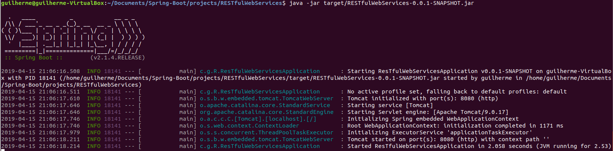
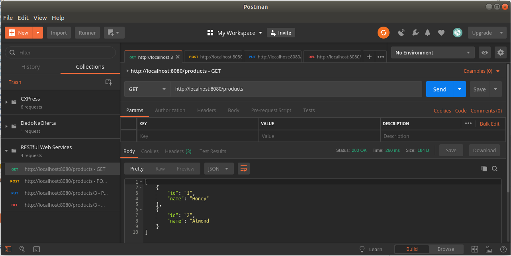
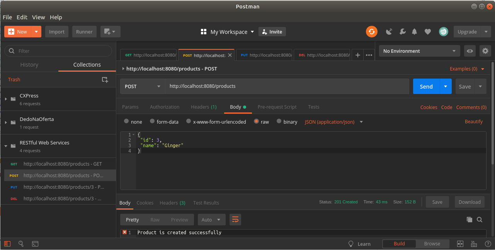
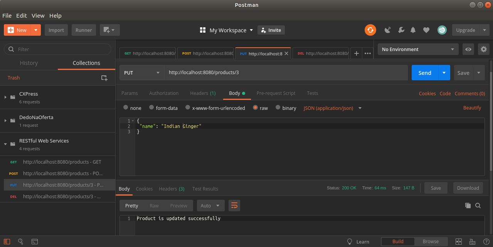
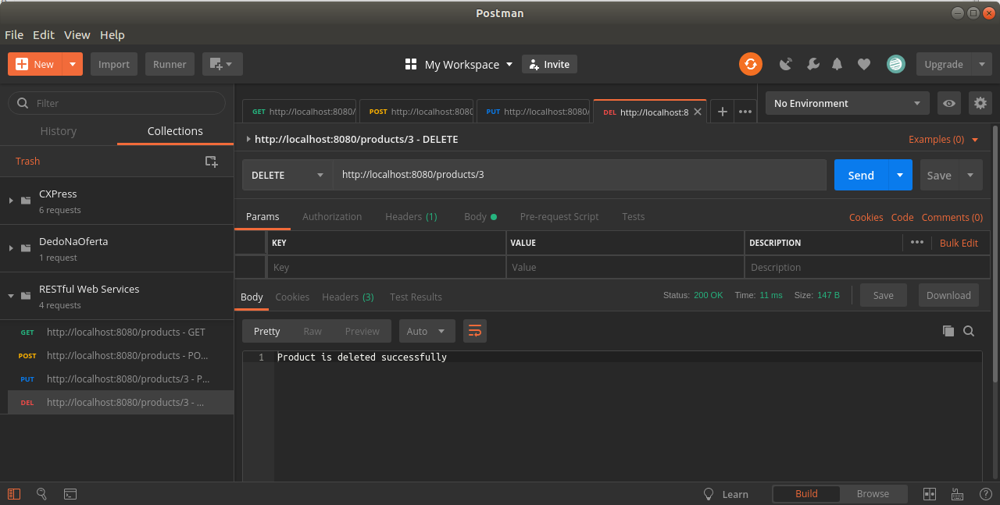

# Spring Boot Studies [](https://github.com/sindresorhus/awesome)
> This repository keeps evolving as I continue covering more functionalities and techniques from Spring boot application.

A generic repository for study purposes, with all the exercises from the https://www.tutorialspoint.com/spring_boot

[Get back to the main Summary Page.](https://github.com/guilhermeborgesbastos/Spring-Boot-Studies)


# Spring Boot - Building RESTful Web Services

*Spring Boot* provides a very good support to building **RESTful Web Services** for enterprise applications. This chapter will explain in detail about building RESTful web services using Spring Boot.

**Note** − For building a RESTful Web Services, we need to add the *Spring Boot Starter Web* dependency into the build configuration file.

If you are a Maven user, use the following code to add the below dependency in your `pom.xml` file −
```
<dependency>
   <groupId>org.springframework.boot</groupId>
   <artifactId>spring-boot-starter-web</artifactId>
</dependency>
```

If you are a *Gradle* user, use the following code to add the below dependency in your `build.gradle` file.
```
compile('org.springframework.boot:spring-boot-starter-web')
```

The code for complete build configuration file Maven build – pom.xml is given below −
```
<?xml version = "1.0" encoding = "UTF-8"?>
<project xmlns = "http://maven.apache.org/POM/4.0.0" 
   xmlns:xsi = "http://www.w3.org/2001/XMLSchema-instance"
   xsi:schemaLocation = "http://maven.apache.org/POM/4.0.0 
   http://maven.apache.org/xsd/maven-4.0.0.xsd">
   
   <modelVersion>4.0.0</modelVersion>
   <groupId>com.tutorialspoint</groupId>
   <artifactId>demo</artifactId>
   <version>0.0.1-SNAPSHOT</version>
   <packaging>jar</packaging>
   <name>demo</name>
   <description>Demo project for Spring Boot</description>
   
   <parent>
      <groupId>org.springframework.boot</groupId>
      <artifactId>spring-boot-starter-parent</artifactId>
      <version>1.5.8.RELEASE</version>
      <relativePath/> 
   </parent>
   
   <properties>
      <project.build.sourceEncoding>UTF-8</project.build.sourceEncoding>
      <project.reporting.outputEncoding>UTF-8</project.reporting.outputEncoding>
      <java.version>1.8</java.version>
   </properties>
   
   <dependencies>
      <dependency>
         <groupId>org.springframework.boot</groupId>
         <artifactId>spring-boot-starter-web</artifactId>
      </dependency>
      <dependency>
         <groupId>org.springframework.boot</groupId>
         <artifactId>spring-boot-starter-test</artifactId>
         <scope>test</scope>
      </dependency>
   </dependencies>
   
   <build>
      <plugins>
         <plugin>
            <groupId>org.springframework.boot</groupId>
            <artifactId>spring-boot-maven-plugin</artifactId>
         </plugin>
      </plugins>
   </build>
   
</project>
```

The code for complete build configuration file Gradle Build – *build.gradle* is given below −
```
buildscript {
   ext {
      springBootVersion = '1.5.8.RELEASE'
   }
   repositories {
      mavenCentral()
   }
   dependencies {
      classpath("org.springframework.boot:spring-boot-gradle-plugin:${springBootVersion}")
   }
}

apply plugin: 'java'
apply plugin: 'eclipse'
apply plugin: 'org.springframework.boot'

group = 'com.tutorialspoint'
version = '0.0.1-SNAPSHOT'
sourceCompatibility = 1.8

repositories {
   mavenCentral()
}

dependencies {
   compile('org.springframework.boot:spring-boot-starter-web')
   testCompile('org.springframework.boot:spring-boot-starter-test')
}
```

Before you proceed to build a RESTful web service, it is suggested that you have knowledge of the following annotations −


## Rest Controller

The **@RestController** annotation is used to define the RESTful web services. It serves JSON, XML and custom response. Its syntax is shown below −
```
@RestController
public class ProductServiceController { 
}
```

## Request Mapping

The** @RequestMapping** annotation is used to define the Request URI to access the REST Endpoints. We can define Request method to consume and produce object. The default request method is `GET`.
```
@RequestMapping(value = "/products")
public ResponseEntity<Object> getProducts() { }
```

## Request Body

The **@RequestBody** annotation is used to define the request body content type.
```
public ResponseEntity<Object> createProduct(@RequestBody Product product) {
}
```

## Path Variable

The **@PathVariable** annotation is used to define the custom or dynamic request URI. The Path variable in request URI is defined as curly braces `{}` as shown below −
```
public ResponseEntity<Object> updateProduct(@PathVariable("id") String id) {
}
```

## Request Parameter

The **@RequestParam** annotation is used to read the request parameters from the Request URL. By default, it is a required parameter. We can also set default value for request parameters as shown here −
```
public ResponseEntity<Object> getProduct(
   @RequestParam(value = "name", required = false, defaultValue = "honey") String name) {
}
```

## GET API

The **default HTTP request** method is *GET*. This method does not require any Request Body. You can send request parameters and path variables to define the custom or dynamic URL.

The sample code to define the HTTP GET request method is shown below. In this example, we used HashMap to store the Product. Note that we used a *POJO* class as the product to be stored.

Here, the request URI is /products and it will return the list of products from HashMap repository. The controller class file is given below that contains GET method REST Endpoint.
```
package com.gbastos.RESTfulWebServices.controller;

import java.util.HashMap;
import java.util.Map;

import org.springframework.http.HttpStatus;
import org.springframework.http.ResponseEntity;
import org.springframework.web.bind.annotation.RequestMapping;
import org.springframework.web.bind.annotation.RestController;

import com.gbastos.RESTfulWebServices.model.Product;

@RestController
public class ProductServiceController {

   private static Map<String, Product> productRepo = new HashMap<>();
   
   static {
      Product honey = new Product();
      honey.setId("1");
      honey.setName("Honey");
      productRepo.put(honey.getId(), honey);
      
      Product almond = new Product();
      almond.setId("2");
      almond.setName("Almond");
      productRepo.put(almond.getId(), almond);
   }
   
   @RequestMapping(value = "/products")
   public ResponseEntity<Object> getProduct() {
      return new ResponseEntity<>(productRepo.values(), HttpStatus.OK);
   }
}
```

## POST API

The HTTP POST request is used to create a resource. This method contains the Request Body. We can send request parameters and path variables to define the custom or dynamic URL.

The following example shows the sample code to define the HTTP POST request method. In this example, we used *HashMap* to store the Product, where the product is a *POJO* class.

Here, the request URI is `/products`, and it will return the String after storing the product into HashMap repository.
```
package com.gbastos.RESTfulWebServices.controller;

import java.util.HashMap;
import java.util.Map;

import org.springframework.http.HttpStatus;
import org.springframework.http.ResponseEntity;
import org.springframework.web.bind.annotation.RequestBody;
import org.springframework.web.bind.annotation.RequestMapping;
import org.springframework.web.bind.annotation.RequestMethod;
import org.springframework.web.bind.annotation.RestController;

import com.gbastos.RESTfulWebServices.model.Product;

@RestController
public class ProductServiceController {

   private static Map<String, Product> productRepo = new HashMap<>();
   
   @RequestMapping(value = "/products", method = RequestMethod.POST)
   public ResponseEntity<Object> createProduct(@RequestBody Product product) {
      productRepo.put(product.getId(), product);
      return new ResponseEntity<>("Product is created successfully", HttpStatus.CREATED);
   }
}
```

## PUT API

The HTTP PUT request is used to update the existing resource. This method contains a Request Body. We can send request parameters and path variables to define the custom or dynamic URL.

The example given below shows how to define the HTTP PUT request method. In this example, we used HashMap to update the existing Product, where the product is a *POJO* class.

Here the request URI is `/products/{id}` which will return the String after a the product into a *HashMap* repository. Note that we used the Path variable `{id}` which defines the products *ID* that needs to be updated.
```
package com.gbastos.RESTfulWebServices.controller;

import java.util.HashMap;
import java.util.Map;

import org.springframework.http.HttpStatus;
import org.springframework.http.ResponseEntity;
import org.springframework.web.bind.annotation.PathVariable;
import org.springframework.web.bind.annotation.RequestBody;
import org.springframework.web.bind.annotation.RequestMapping;
import org.springframework.web.bind.annotation.RequestMethod;
import org.springframework.web.bind.annotation.RestController;
import com.gbastos.RESTfulWebServices.model.Product;

@RestController
public class ProductServiceController {

   private static Map<String, Product> productRepo = new HashMap<>();
   
   @RequestMapping(value = "/products/{id}", method = RequestMethod.PUT)
   public ResponseEntity<Object> updateProduct(@PathVariable("id") String id, @RequestBody Product product) { 
      productRepo.remove(id);
      product.setId(id);
      productRepo.put(id, product);
      return new ResponseEntity<>("Product is updated successsfully", HttpStatus.OK);
   } 
}
```

## DELETE API

The HTTP Delete request is used to delete the existing resource. This method does not contain any Request Body. We can send request parameters and path variables to define the custom or dynamic URL.

The example given below shows how to define the HTTP DELETE request method. In this example, we used HashMap to remove the existing product, which is a *POJO* class.

The request URI is `/products/{id}` and it will return the String after deleting the product from *HashMap* repository. We used the Path variable `{id}` which defines the products ID that needs to be deleted.
```
package com.gbastos.RESTfulWebServices.controller;

import java.util.HashMap;
import java.util.Map;

import org.springframework.http.HttpStatus;
import org.springframework.http.ResponseEntity;
import org.springframework.web.bind.annotation.PathVariable;
import org.springframework.web.bind.annotation.RequestBody;
import org.springframework.web.bind.annotation.RequestMapping;
import org.springframework.web.bind.annotation.RequestMethod;
import org.springframework.web.bind.annotation.RestController;

import com.gbastos.RESTfulWebServices.model.Product;

@RestController
public class ProductServiceController {
   private static Map<String, Product> productRepo = new HashMap<>();
   
   @RequestMapping(value = "/products/{id}", method = RequestMethod.DELETE)
   public ResponseEntity<Object> delete(@PathVariable("id") String id) { 
      productRepo.remove(id);
      return new ResponseEntity<>("Product is deleted successsfully", HttpStatus.OK);
   }
}
```

This section gives you the complete set of source code. Observe the following codes for their respective functionalities −

### The Spring Boot main application class – *DemoApplication.java*
```
package com.gbastos.RESTfulWebServices;

import org.springframework.boot.SpringApplication;
import org.springframework.boot.autoconfigure.SpringBootApplication;

@SpringBootApplication
public class DemoApplication {
   public static void main(String[] args) {
      SpringApplication.run(DemoApplication.class, args);
   }
}
```

### The POJO class – *Product.java*
```
package com.gbastos.RESTfulWebServices.model;

public class Product {
   private String id;
   private String name;

   public String getId() {
      return id;
   }
   public void setId(String id) {
      this.id = id;
   }
   public String getName() {
      return name;
   }
   public void setName(String name) {
      this.name = name;
   }
}
```

### The Rest Controller class – *ProductServiceController.java*
```

package com.gbastos.RESTfulWebServices.controller;

import java.util.HashMap;
import java.util.Map;

import org.springframework.http.HttpStatus;
import org.springframework.http.ResponseEntity;
import org.springframework.web.bind.annotation.PathVariable;
import org.springframework.web.bind.annotation.RequestBody;
import org.springframework.web.bind.annotation.RequestMapping;
import org.springframework.web.bind.annotation.RequestMethod;
import org.springframework.web.bind.annotation.RestController;

import com.gbastos.RESTfulWebServices.model.Product;

@RestController
public class ProductServiceController {
   private static Map<String, Product> productRepo = new HashMap<>();
   static {
      Product honey = new Product();
      honey.setId("1");
      honey.setName("Honey");
      productRepo.put(honey.getId(), honey);
      
      Product almond = new Product();
      almond.setId("2");
      almond.setName("Almond");
      productRepo.put(almond.getId(), almond);
   }
   
   @RequestMapping(value = "/products/{id}", method = RequestMethod.DELETE)
   public ResponseEntity<Object> delete(@PathVariable("id") String id) { 
      productRepo.remove(id);
      return new ResponseEntity<>("Product is deleted successsfully", HttpStatus.OK);
   }
   
   @RequestMapping(value = "/products/{id}", method = RequestMethod.PUT)
   public ResponseEntity<Object> updateProduct(@PathVariable("id") String id, @RequestBody Product product) { 
      productRepo.remove(id);
      product.setId(id);
      productRepo.put(id, product);
      return new ResponseEntity<>("Product is updated successsfully", HttpStatus.OK);
   }
   
   @RequestMapping(value = "/products", method = RequestMethod.POST)
   public ResponseEntity<Object> createProduct(@RequestBody Product product) {
      productRepo.put(product.getId(), product);
      return new ResponseEntity<>("Product is created successfully", HttpStatus.CREATED);
   }
   
   @RequestMapping(value = "/products")
   public ResponseEntity<Object> getProduct() {
      return new ResponseEntity<>(productRepo.values(), HttpStatus.OK);
   }
}
```

You can create an executable JAR file, and run the spring boot application by using the below Maven or Gradle commands as shown −

For Maven, use the command shown below −
```
mvn clean install
```

After *“BUILD SUCCESS”*, you can find the JAR file under the `target` directory.

For Gradle, use the command shown below −
```
gradle clean build
```

After *“BUILD SUCCESSFUL”*, you can find the JAR file under the `build/libs` directory.

You can run the JAR file by using the command shown below −
```
java –jar <JARFILE> 
```

**Note** - This will start the application on the Tomcat port 8080 as shown below −



Now hit the URL shown below in *POSTMAN* application and see the output.

### GET API URL is: http://localhost:8080/products


### POST API URL is: http://localhost:8080/products


### PUT API URL is: http://localhost:8080/products/3


### DELETE API URL is: http://localhost:8080/products/3

